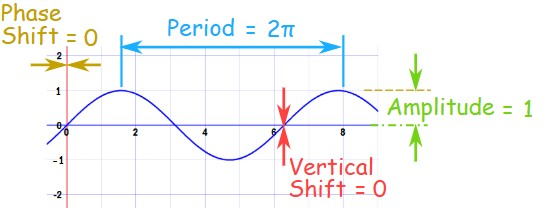
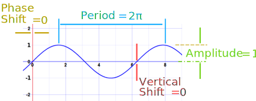
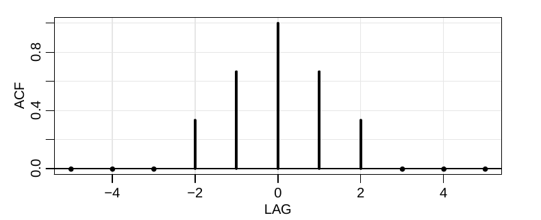

```{r setup, include=FALSE}
knitr::opts_chunk$set(fig.align='center')
```

```{r libraries, include=FALSE}
library(astsa)
library(xts)
```

# Course Outline

- The goal is to learn modern time series models on either time or frequency domain. Students shall be able to understand the underlying mathematical structure as well as to make practical applications of these models.

## Text

- Shumway, R. H. and Stoffer, D. S. (2017), Time Series Analysis and its Applications: With R Examples (Fourth ed.), Springer.

## Others

- Box, G. E. P., Jenkins, G. M., Reinsel, G. C., and Ljung, G. M. (2016), Time Series Analysis: Forecasting and Control (Fifth ed.), Wiley.
- Brockwell, P. J. and Davis, R. A. (1991), Time Series: Theory and Methods (Second ed.), Springer.
- Wei, W. W. S. (2006), Time Series Analysis: Univariate and Multivariate Methods (Second ed.), Pearson Addison Wesley.
- Cryer, J. D. and Chan, K.-S. (2008), Time Series Analysis with Applications in R (Second ed.), Springer.
- Palma, W. (2016), Time Series Analysis, Wiley.

## Statistical Software

- R, <https://www.r-project.org/>.
- Time Series Modelling (TSM), <http://www.timeseriesmodelling.com/>.
- Scientific Computing Associates (SCA), <http://www.scausa.com/>.

## Assessment

- Midterm Exam (40%).
- Presentation I (15%).
- Presentations II (15%).
- Project (30%).

## Schedule

| Fecha      | Tema                                                 |
|:-----------|:-----------------------------------------------------|
| Vie Feb 6  | Characteristics of time series                       |
| Sab Feb 7  | Time series regression and exploratory data analysis |
| Vie Feb 13 | ARIMA models: AR, MA  models                         |
| Sáb Feb 14 | ARIMA models: ARMA, ARIMA models                     |
| Vie Feb 20 | ARIMA models: Estimation and forecasting             |
| Sab Feb 21 | ARIMA models: Estimation and forecasting             |
| Sab Feb 21 | **Actividad evaluativa 1**                           |
| Vie Feb 27 | Spectral analysis and filtering                      |
| Sab Feb 28 | Spectral analysis and filtering                      |
| Vie Mar 06 | Spectral analysis and filtering                      |
| Sab Mar 07 | State Space Models                                   |
| Vie Mar 13 | State Space Models                                   |
| Sab Mar 14 | State Space Models                                   |
| Sab Mar 14 | **Actividad evaluativa 2**                           |

| Date   | Topic                                                             |
|:-------|:------------------------------------------------------------------|
| Jan 24 | Characteristics of time series                                    |
| Jan 31 | Time series regression and exploratory data analysis              |
| Feb 07 | ARIMA models                                                      |
| Feb 14 | ARIMA models                                                      |
| Feb 21 | Spectral analysis and filtering                                   |
| Feb 28 | Spectral analysis and filtering                                   |
| Mar 06 | **Midterm Exam**                                                  |
| Mar 13 | Additional time domain topics (**presentation I**)                |
| Mar 20 | State space models                                                |
| Mar 27 | State space models                                                |
| Apr 03 | Statistical methods in the frequency domain (**presentation II**) |
| Apr 17 | **Projects**                                                      |

# Characteristics of time series

- The first step in any time series investigation always involves careful examination of the recorded data plotted over time.

- This scrutiny often suggests the method of analysis as well as statistics that will be of use in summarizing the information in the data.

## Approaches

- Time domain: views the investigation of lagged relationships as most important (e.g., how does what happened today affect what will happen tomorrow).

- Frequency domain: views the investigation of cycles as most important (e.g., what is the economic cycle through periods of expansion and recession).

## Examples

### Johnson & Johnson Quarterly Earnings

- Quarterly earnings per share for the U.S. company Johnson & Johnson. There are 84 quarters (21 years) measured from the first quarter of 1960 to the last quarter of 1980.

```{r example1-1}
tsplot(jj, type="o", ylab="Quarterly Earnings per Share")
```

- Modeling such series begins by observing the primary patterns in the time history. In this case, note
  - the gradually increasing underlying trend and
  - the rather regular variation superimposed on the trend that seems to repeat over quarters.

### Global Warming

- Global mean land–ocean temperature index from 1880 to 2015, with the base period 1951-1980. In particular, the data are deviations, measured in degrees centigrade, from the 1951-1980 average.

```{r example1-2}
tsplot(gtemp_both, type="o", ylab="Global Temperature Deviations")
```

- We note
  - an apparent upward trend in the series during the latter part of the twentieth century that has been used as an argument for the global warming hypothesis.
  - Also, the leveling off at about 1935 and then another rather sharp upward trend at about 1970.

- The question of interest for global warming proponents and opponents is whether the overall trend is natural or whether it is caused by some human-induced interface.

- Again, the question of trend is of more interest than particular periodicities.

### Speech Data

- A small $.1$ second (1000 point) sample of recorded speech for the phrase $aaa\ldots hhh$.

```{r example1-3}
tsplot(speech)
```

- We note
  - the repetitive nature of the signal and the rather regular periodicities.

- One current problem of great interest is computer recognition of speech, which would require converting this particular signal into the recorded phrase $aaa\ldots hhh$.

- Spectral analysis can be used in this context to produce a signature of this phrase that can be compared with signatures of various library syllables to look for a match.

### Dow Jones Industrial Average

- Daily returns (or percent change) of the Dow Jones Industrial Average (DJIA) from April 20, 2006 to April 20, 2016.

```{r example1-4}
djiar = diff(log(djia$Close))[-1]
plot(djiar, main="DJIA Returns")
```

- Note that
  - it is easy to spot the financial crisis of 2008 and
  - the mean of the series appears to be stable with an average return of approximately zero, however, highly
volatile (variable) periods tend to be clustered together.

- A problem in the analysis of these type of financial data is to forecast the volatility of future returns.

### El Niño and Fish Population

- Monthly values of an environmental series called the Southern Oscillation Index (SOI) and associated Recruitment (number of new fish). Both series are for a period of 453 months ranging over the years 1950–1987.

```{r example1-5}
par(mfrow = c(2,1))
tsplot(soi, ylab="", main="Southern Oscillation Index")
tsplot(rec, ylab="", main="Recruitment") 
```

- Both series exhibit repetitive behavior, with regularly repeating cycles that are easily visible.

- This periodic behavior is of interest because underlying processes of interest may be regular and the rate or frequency of oscillation characterizing the behavior of the underlying series would help to identify them.

- The two series are also related; it is easy to imagine the fish population is dependent on the ocean temperature. This possibility suggests trying some version of regression analysis as a procedure for relating the two series.

### fMRI Imaging

- Data collected from various locations in the brain via functional magnetic resonance imaging (fMRI).

- The stimulus was applied for 32 seconds and then stopped for 32 seconds; thus, the signal period is 64 seconds. The sampling rate was one observation every 2 seconds for 256 seconds (n = 128).

- The series are consecutive measures of blood oxygenation-level dependent (bold) signal intensity, which measures areas of activation in the brain.

```{r example1-6}
par(mfrow=c(2,1), mar=c(3,2,1,0)+.5, mgp=c(1.6,.6,0))  
ts.plot(fmri1[,2:5], col=1:4, ylab="BOLD", xlab="", main="Cortex")
ts.plot(fmri1[,6:9], col=1:4, ylab="BOLD", xlab="", main="Thalamus & Cerebellum")
mtext("Time (1 pt = 2 sec)", side=1, line=2) 
```

- Periodicities appear strongly in the motor cortex series and less strongly in the thalamus and cerebellum.

- The fact that one has series from different areas of the brain suggests testing whether the areas are responding differently to the stimulus.

### Earthquakes and Explosions

- The series represent two phases or arrivals along the surface, denoted by P ($t=1,\ldots , 1024$) and S ($t=1025,\ldots , 2048$), at a seismic recording station. The recording instruments in Scandinavia are observing earthquakes and mining explosions.

```{r example1-7}
par(mfrow=c(2,1))
tsplot(EQ5, main="Earthquake")
tsplot(EXP6, main="Explosion")
```

- The general problem of interest is in distinguishing or discriminating between waveforms generated by earthquakes and those generated by explosions.

- Features that may be important are the rough amplitude ratios of the first phase P to the second phase S, which tend to be smaller for earthquakes than for explosions.

- Remember:

```{r amplitude-period, echo=FALSE}
#
```

## Time Series Statistical Models

- The primary objective of time series analysis is to develop mathematical models that provide plausible descriptions for sample data.

- A time series can be defined as a collection of random variables indexed according to the order they are
obtained in time.

- For example, we may consider a time series as a sequence of random variables, $x_{1}, x_{2}, x_{3},\ldots$, where

  - the random variable $x_{1}$ denotes the value taken by the series at the first time point,
  - the variable $x_{2}$ denotes the value for the second time period,
  - $x_{3}$ denotes the value for the third time period, and so on.

- In general, a collection of random variables, $\{x_{t}\}$, indexed by $t$ is referred to as a stochastic process.

- $t$ will typically be discrete and vary over the integers $t=0, \pm1, \pm2,\ldots$, or some subset of the integers. The observed values of a stochastic process are referred to as a realization of the stochastic process.

- The fundamental visual characteristic distinguishing the different series shown before is their differing degrees of smoothness.

- One possible explanation for this smoothness is that it is being induced by the supposition that adjacent points in time are correlated, so the value of the series at time $t$, say, $x_{t}$, depends in some way on the past values $x_{t-1}, x_{t-2},\ldots$.

- This model expresses a fundamental way in which we might think about generating realistic-looking time series. To begin to develop an approach to using collections of random variables to model time series, consider the following example.

### Example: White Noise (3 flavors)

- A simple kind of generated series might be a collection of uncorrelated random variables, $w_{t}$, with mean $0$ and finite variance $\sigma^{2}_{w}$.

- The time series generated from uncorrelated variables is used as a model for noise in engineering applications,
where it is called white noise; we shall denote this process as $w_{t}\sim \textrm{wn}(0, \sigma^{2}_{w})$.

- The designation white originates from the analogy with white light and indicates that all possible periodic oscillations are present with equal strength.

- We will sometimes require the noise to be independent and identically distributed (iid) random variables with mean $0$ and variance $\sigma^{2}_{w}$. We distinguish this by writing $w_{t}\sim \textrm{iid}(0, \sigma^{2}_{w})$ or by saying white independent noise or iid noise.

- A particularly useful white noise series is Gaussian white noise, wherein the $w_{t}$ are independent normal random variables, with mean $0$ and variance $\sigma^{2}_{w}$; or more succinctly, $w_{t}\sim \textrm{iid}\;\textrm{N}(0, \sigma^{2}_{w})$.

- The following figure shows a collection of 500 such random variables, with $\sigma^{2}_{w}=1$, plotted in the order in which they were drawn.
```{r example1-8}
w = rnorm(500,0,1)
plot.ts(w, main="white noise")
```

- If the stochastic behavior of all time series could be explained in terms of the white noise model, classical statistical methods would suffice.

- Two ways of introducing serial correlation and more smoothness into time series models are given in following examples.

### Example: Moving Averages and Filtering

- We might replace the white noise series $w_{t}$ by a moving average that smooths the series. For example, consider replacing $w_{t}$ by an average of its current value and its immediate neighbors in the past and future.

- That is, let
\[
\nu_{t}=\frac{1}{3}(w_{t-1}+w_{t}+w_{t+1}),
\]
which leads to the series
```{r example1-9}
v = filter(w, sides=2, rep(1/3,3))
tsplot(v, ylim=c(-3,3), main="moving average")
```

- A linear combination of values in a time series such as before is referred to, generically, as a filtered series.

- Some series differ from the moving average series because one particular kind of oscillatory behavior seems to predominate, producing a sinusoidal type of behavior. A number of methods exist for generating series with
this quasi-periodic behavior; we illustrate a popular one based on the autoregressive model.

### Example: Autoregressions

- Suppose we consider the white noise series $w_{t}$ as input and calculate the output using the second-order equation
\[
x_{t}=x_{t-1}-0.9x_{t-2}+w_{t}
\]
successively for $t = 1, 2,\ldots, 500$. This Equation represents a regression or prediction of the current value $x_{t}$ of a time series as a function of the past two values of the series, and, hence, the term autoregression is suggested for this model.

- A problem with startup values exists here because the model also depends on the initial conditions $x_{0}$ and $x_{-1}$, but assuming we have the values, we generate the succeeding values by substituting into the previous equation. The resulting output series is shown the following figure, and we note the periodic behavior of the series.
```{r example1-10}
w = rnorm(550,0,1)
x = filter(w, filter=c(1,-.9), method="recursive")[-(1:50)]
tsplot(x, main="autoregression")
```

### Example: Random Walk with Drift

- A model for analyzing trend is the random walk with drift model given by
\[
x_{t}=\delta +x_{t-1}+w_{t}
\]
for $t = 1, 2,\ldots$, with initial condition $x_{0}=0$, and where $w_{t}$ is white noise.

- The constant $\delta$ is called the drift, and when $\delta =0$, this model is called simply a random walk.

- The term random walk comes from the fact that, when $\delta =0$, the value of the time series at time $t$ is the value of the series at time $t−1$ plus a completely random movement determined by $w_{t}$.

- Note that
\[
x_{t}=\delta t+\sum_{j=1}^{t}w_{j}
\]
for $t=1, 2,\ldots$.

- The following figure shows $200$ observations generated from the model with $\delta =0$ and $.2$, and with $\sigma_{w}=1$. For comparison, we also superimposed the straight line $.2t$ on the graph.
```{r example1-11}
set.seed(154)
w = rnorm(200); x = cumsum(w)
wd = w +.2;    xd = cumsum(wd)
tsplot(xd, ylim=c(-5,55), main="random walk", ylab='')
lines(x, col=4) 
abline(h=0, col=4, lty=2)
abline(a=0, b=.2, lty=2)
```

### Example: Signal in Noise

- Many realistic models for generating time series assume an underlying signal with some consistent periodic variation, contaminated by adding a random noise. Consider the model
\[
x_{t}=2\cos (2\pi \frac{t+15}{50})+w_{t}
\]
for $t=1, 2,\ldots , 500$, where the first term is regarded as the signal, shown in the upper panel of the following figure.

- An additive noise term was taken to be white noise with $\sigma_{w} =1$ (middle panel) and $\sigma_{w} =5$ (bottom panel), drawn from a normal distribution.
```{r example1-12}
cs = 2*cos(2*pi*(1:500)/50 + .6*pi)
w = rnorm(500,0,1)
par(mfrow=c(3,1), mar=c(3,2,2,1), cex.main=1.5)   # help(par) for info
tsplot(cs, ylab="", main = expression(x[t]==2*cos(2*pi*t/50+.6*pi)))
tsplot(cs + w, ylab="", main = expression(x[t]==2*cos(2*pi*t/50+.6*pi)+N(0,1)))
tsplot(cs + 5*w, ylab="", main = expression(x[t]==2*cos(2*pi*t/50+.6*pi)+N(0,25)))
```

- We note that a sinusoidal waveform can be written as
\[
A\cos (2\pi \omega t+\phi),
\]
where $A$ is the *amplitude*, $\omega$ is the *frequency of oscillation*, and $\phi$ is a *phase shift*.

- In the above example, $A=2$, $\omega=1/50$ (one cycle every $50$ time points), and $\phi=2\pi 15/50=.6\pi$.

- Adding $w_{t}$ obscures the signal. Of course, the degree to which the signal is obscured depends on the amplitude of the signal and the size of $\sigma_{w}$.

- Typically, we will not observe the signal but the signal obscured by noise.

- We will study the use of spectral analysis as a possible technique for detecting regular or periodic signals.

- In general, we would emphasize the importance of simple additive models such as given above in the form
\[
x_{t}=s_{t}+\nu_{t},
\]
where $s_{t}$ denotes some unknown signal and $\nu_{t}$ denotes a time series that may be white or correlated over time.

- The problems of detecting a signal and then in estimating or extracting the waveform of $s_{t}$ are of great interest in many areas of engineering and the physical and biological sciences.

- In economics, the underlying signal may be a trend or it may be a seasonal component of a series.

- Models such as before, where the signal has an autoregressive structure, form the motivation for the state-space.

## Measures of Dependence

- A complete description of a time series, observed as a collection of $n$ random variables at arbitrary time points $t_{1}, t_{2},\ldots , t_{n}$, for any positive integer $n$, is provided by the joint distribution function,
\[
F_{t_{1}, t_{2},\ldots ,t_{n}}(c_{1}, c_{2},\ldots ,c_{n})=\textrm{Pr}(x_{t_{1}}\leq c_{1}, x_{t_{2}}\leq c_{2},\ldots , x_{t_{n}}\leq c_{n}).
\]

- The marginal distribution functions
\[
F_{t}(x)=P\{x_{t}\leq x\}
\]
or the corresponding marginal density functions
\[
f_{t}(x)=\frac{\partial F_{t}(x)}{\partial x},
\]
when they exist, are often informative for examining the marginal behavior of a series.

- Another informative marginal descriptive measure is the mean function.

### Mean Function

> The mean function is defined as
\[
\mu_{x_{t}}=\textrm{E}(x_{t})=\int_{-\infty}^{\infty}xf_{t}(x)dx,
\]
provided it exists, where $\textrm{E}$ denotes the usual expected value operator. When no confusion exists about which time series we are referring to, we will drop a subscript and write $\mu_{x_{t}}$ as $\mu_{t}$.

### Example: Mean Function of a Moving Average Series

- If $w_{t}$ denotes a white noise series, then $\mu_{w_{t}}=\textrm{E}(w_{t})=0$ for all $t$. Let
\[
\nu_{t}=\frac{1}{3}(w_{t-1}+w_{t}+w_{t+1}),
\]
where $w_{t}$ is white noise. Then
\[
\mu_{\nu_{t}}=\textrm{E}(\nu_{t})=\frac{1}{3}[\textrm{E}(w_{t-1})+\textrm{E}(w_{t})+\textrm{E}(w_{t+1})]=0.
\]

### Example: Mean Function of a Random Walk with Drift

- Consider the random walk with drift model
\[
x_{t}=\delta t+\sum_{j=1}^{t}w_{j},\quad t=1, 2,\ldots .
\]
Because $\textrm{E}(w_{t})=0$ for all $t$, and $\delta$ is a constant, we have
\[
\mu_{x_{t}}=\textrm{E}(x_{t})=\delta t+\sum_{j=1}^{t}\textrm{E}(w_{j})=\delta t
\]
which is a straight line with slope $\delta$.

### Example: Mean Function of Signal Plus Noise

- On the model
\[
x_{t}=2\cos (2\pi \frac{t+15}{50})+w_{t}
\]
we have
\begin{align*}
\mu_{x_{t}} =\textrm{E}(x_{t}) & =\textrm{E}[2\cos(2\pi\frac{t+15}{50})+w_{t}]\\
 & =2\cos(2\pi\frac{t+15}{50})+\textrm{E}(w_{t})\\
 & =2\cos(2\pi\frac{t+15}{50}),
\end{align*}
and the mean function is just the cosine wave.

- The lack of independence between two adjacent values $x_{s}$ and $x_{t}$ can be assessed numerically, as in classical statistics, using the notions of covariance and correlation.

### Autocovariance Function

- Assuming the variance of $x_{t}$ is finite, we have the following definition.

> The autocovariance function is defined as the second moment product
\[
\gamma_{x}(s, t)=\textrm{cov}(x_{s}, x_{t})=\textrm{E}[(x_{s}-\mu_{s})(x_{t}-\mu_{t})],
\]
for all $s$ and $t$. When no possible confusion exists about which time series we are referring to, we will drop the subscript and write $\gamma_{x}(s, t)$ as $\gamma (s, t)$. Note that $\gamma_{x}(s, t)=\gamma_{x}(t, s)$ for all time points $s$ and $t$.

- The autocovariance measures the linear dependence between two points on the same series observed at different times.

- Recall from classical statistics that if $\gamma_{x}(s, t)=0$, $x_{s}$ and $x_{t}$ are not linearly related, but there still may be some dependence structure between them.

- If, however, $x_{s}$ and $x_{t}$ are bivariate normal, $\gamma_{x}(s, t)=0$ ensures their independence.

- For $s=t$, the autocovariance reduces to the (assumed finite) variance
\[
\gamma_{x}(t, t)=\textrm{E}[(x_{t}-\mu_{t})^2]=\textrm{var}(x_{t}).
\]

### Example: Autocovariance of White Noise

- The white noise series $w_{t}$ has $\textrm{E}(w_{t})=0$ and
\[
\gamma_{w}(s,t)=\textrm{cov}(w_{s},w_{t})=\begin{cases}
\sigma_{w}^{2} & s=t,\\
0 & s\neq t.
\end{cases}
\]

### Covariance of Linear Combinations

- If the random variables
\[
U=\sum_{j=1}^{m}a_{j}X_{j}\quad\textrm{and}\quad V=\sum_{k=1}^{r}b_{k}Y_{k}
\]
are linear combinations of (finite variance) random variables $\{X_j\}$ and $\{Y_k\}$, respectively, then
\[
\textrm{cov}(U,V)=\sum_{j=1}^{m}\sum_{k=1}^{r}a_{j}b_{k}\textrm{cov}(X_{j},Y_{k}).
\]
Furthermore, $\textrm{var}(U)=\textrm{cov}(U, U)$.

### Example: Autocovariance of a Moving Average

- Consider
\[
\nu_{t}=\frac{1}{3}(w_{t-1}+w_{t}+w_{t+1}).
\]

- In this case,
\[
\gamma_{\nu}(s, t)=\textrm{cov}(\nu_{s}, \nu_{t})=\textrm{cov}\{\frac{1}{3}(w_{s-1}+w_{s}+w_{s+1}),\frac{1}{3}(w_{t-1}+w_{t}+w_{t+1})\}.
\]

- When $s=t$ we have
\begin{align*}
\gamma_{\nu}(t,t) & =\frac{1}{9}\textrm{cov}\{(w_{t-1}+w_{t}+w_{t+1}),(w_{t-1}+w_{t}+w_{t+1})\}\\
 & =\frac{1}{9}[\textrm{cov}(w_{t-1},w_{t-1})+\textrm{cov}(w_{t},w_{t})+\textrm{cov}(w_{t+1},w_{t+1})]\\
 & =\frac{3}{9}\sigma_{w}^{2}.
\end{align*}

- When $s=t+1$
\begin{align*}
\gamma_{\nu}(t+1,t) & =\frac{1}{9}\textrm{cov}\{(w_{t}+w_{t+1}+w_{t+2}),(w_{t-1}+w_{t}+w_{t+1})\}\\
 & =\frac{1}{9}[\textrm{cov}(w_{t},w_{t})+\textrm{cov}(w_{t+1},w_{t+1})]\\
 & =\frac{2}{9}\sigma_{w}^{2}.
\end{align*}

- Similar computations give $\gamma_{\nu}(t-1,t)=\frac{2}{9}\sigma_{w}^{2}$, $\gamma_{\nu}(t+2,t)=\gamma_{\nu}(t-2,t)=\frac{1}{9}\sigma_{w}^{2}$, and $0$ when $\left|t-s\right|>2$.

- We summarize the values for all $s$ and $t$ as
\[
\gamma_{\nu}(s,t)=\begin{cases}
\frac{3}{9}\sigma_{w}^{2} & s=t,\\
\frac{2}{9}\sigma_{w}^{2} & \left|t-s\right|=1,\\
\frac{1}{9}\sigma_{w}^{2} & \left|t-s\right|=2,\\
0 & \left|t-s\right|>2.
\end{cases}
\]

### Example: Autocovariance of a Random Walk

- For the random walk model, $x_{t}=\sum_{j=1}^{t}w_{j}$, we have
\[
\gamma_{x}(s,t)=\textrm{cov}(x_{s},x_{t})=\textrm{cov}(\sum_{j=1}^{s}w_{j},\sum_{k=1}^{t}w_{k})=\min\{s,t\}\sigma_{w}^{2},
\]
because the $w_{t}$ are uncorrelated random variables.

- Notice that the variance of the random walk,
\[
\textrm{var}(x_{t})=\gamma_{x}(t, t)=t\sigma_{w}^{2},
\]
increases without bound as time $t$ increases.

### Autocorrelation Function

> The autocorrelation function (ACF) is defined as
\[
\rho (s, t)=\frac{\gamma (s, t)}{\sqrt{\gamma (s, s)\gamma (t, t)}}.
\]

- The ACF measures the linear predictability of the series at time $t$, say $x_{t}$, using only the value $x_{s}$.

- $-1\leq \rho (s, t)\leq 1$. The Cauchy–Schwarz inequality implies $\left|\gamma(s,t)\right|^{2}\leq\gamma(s,s)\gamma(t,t)$.

### The Cross-Covariance Function

- Often, we would like to measure the predictability of another series $y_{t}$ from the series $x_{s}$. Assuming both series have finite variances

> The cross-covariance function between two series, $x_{s}$ and $y_{t}$, is
\[
\gamma_{xy}(s,t)=\textrm{cov}(x_{s},y_{t})=\textrm{E}[(x_{s}-\mu_{x_{s}})(y_{t}-\mu_{y_{t}})].
\]

### The Cross-Correlation Function

> The cross-correlation function (CCF) is given by
\[
\rho_{xy}(s,t)=\frac{\gamma_{xy}(s,t)}{\sqrt{\gamma_{x}(s,s)\gamma_{y}(t,t)}}
\]

- We may easily extend the above ideas to the case of more than two series, say, $x_{t_{1}}, x_{t_{2}},\ldots , x_{t_{r}}$; that is, multivariate time series with $r$ components. For example
\[
\gamma_{jk}(s,t)=\textrm{E}[(x_{s_{j}}-\mu_{s_{j}})(x_{t_{k}}-\mu_{t_{k}})]\quad j,k=1,2,\ldots,r.
\]

## Stationary Time Series

- In the definitions above, the autocovariance and cross-covariance functions may change as one moves along the series because the values depend on both $s$ and $t$, the locations of the points in time.

### Strictly Stationary

> A strictly stationary time series is one for which the probabilistic behavior of every collection of values
\[
\{x_{t_{1}},x_{t_{2}},\ldots,x_{t_{k}}\}
\]
is identical to that of the time shifted set
\[
\{x_{t_{1}+h},x_{t_{2}+h},\ldots,x_{t_{k}+h}\}.
\]
That is,
\[
\textrm{Pr}\{x_{t_{1}}\leq c_{1},\ldots,x_{t_{k}}\leq c_{k}\}=\textrm{Pr}\{x_{t_{1}+h}\leq c_{1},\ldots,x_{t_{k}+h}\leq c_{k}\}
\]
for all $k=1, 2,\ldots$, all time points $t_{1}, t_{2},\ldots , t_{k}$, all numbers $c_{1}, c_{2},\ldots , c_{k}$, and all time shifts $h=0, \pm 1, \pm 2,\ldots$.

- For example, when $k=1$, it implies that
\[
\textrm{Pr}\{x_{s}\leq c\}=\textrm{Pr}\{x_{t}\leq c\}
\]
for any time points $s$ and $t$.

- It implies that if the mean function, $\mu_{t}$, of the series exists, then $\mu_{s}=\mu_{t}$ for all $s$ and $t$, and hence $\mu_{t}$ must be constant.

- A random walk process with drift is not strictly stationary. Why?

- When k = 2, we have
\[
\textrm{Pr}\{x_{s}\leq c_{1},x_{t}\leq c_{2}\}=\textrm{Pr}\{x_{s+h}\leq c_{1},x_{t+h}\leq c_{2}\}
\]
for any time points $s$ and $t$ and shift $h$. Thus, if the variance function of the process
exists, it implies that the autocovariance function of the series $x_{t}$ satisfies
\[
\gamma(s,t)=\gamma(s+h,t+h)
\]
for all $s$ and $t$ and $h$.

- The autocovariance function of the process depends only on the time difference between $s$ and $t$, and not on the actual times.

### Weakly Stationary

- The strictly stationarity is too strong for most applications.

> A weakly stationary time series, $x_{t}$, is a finite variance process such that  
$\quad$ i -- the mean value function, $\mu_{t}$,is constant and does not depend on time $t$, and  
$\quad$ ii -- the autocovariance function, $\gamma (s, t)$, depends on $s$ and $t$ only
through their difference $\left| s-t\right|$.  
Henceforth, we will use the term stationary to mean weakly stationary; if a process is stationary in the strict sense, we will use the term strictly stationary.

- A strictly stationary, finite variance, time series is also stationary.

- The converse is not true unless there are further conditions.

-One important case where stationarity implies strict stationarity is if the time series is Gaussian.

- Because the mean function, $\textrm{E}(x_{t})=\mu_{t}$, of a stationary time series is independent
of time $t$, we will write
\[
\mu_{t}=\mu.
\]

- Because the autocovariance function, $\gamma (s, t)$, of a stationary time series, $x_{t}$, depends on $s$ and $t$ only through their difference $\left|s-t\right|$, we have
\[
\gamma (t+h, t)=\textrm{cov}(x_{t+h}, x_{t})=\textrm{cov}(x_{h},x_{0})=\gamma (h,0)
\]
where $s=t+h$, where $h$ represents the time shift or lag.

### Autocovariance Function of a Stationary Time Series

> The autocovariance function of a stationary time series will be written as
\[
\gamma (h)=\textrm{cov}(x_{t+h},x_{t})=\textrm{E}[(x_{t+h}-\mu)(x_{t}-\mu)].
\]

### Autocorrelation Function (ACF) of a Stationary Time Series

> The autocorrelation function (ACF) of a stationary time series will be written as
\[
\rho (h)=\frac{\gamma(t+h,t)}{\sqrt{\gamma(t+h,t+h)\gamma(t,t)}}=\frac{\gamma(h)}{\gamma(0)}.
\]

### Example: Stationarity of White Noise

- The mean and autocovariance functions of the white noise series are $\mu_{w_{t}}=0$ and
\[
\gamma_{w}(h)=\textrm{cov}(w_{t+h},w_{t})=\begin{cases}
\sigma_{w}^{2} & h=0,\\
0 & h\neq0.
\end{cases}
\]

- The white noise is weakly stationary or stationary. If the white noise variates are also normally distributed or Gaussian, the series is also strictly stationary.

### Example: Stationarity of a Moving Average

- Consider
\[
\nu_{t}=\frac{1}{3}(w_{t-1}+w_{t}+w_{t+1}).
\]

- This process is stationary because
  - the mean function $\mu_{\nu_{t}}=0$ and
  - the autocovariance function
  \[
  \gamma_{\nu}(h)=\begin{cases}
  \frac{3}{9}\sigma_{w}^{2} & h=0,\\
  \frac{2}{9}\sigma_{w}^{2} & h=\pm 1,\\
  \frac{1}{9}\sigma_{w}^{2} & h=\pm 2,\\
  0 & \left|h\right|>2.
  \end{cases}
  \]
  are independent of time $t$.
  - The autocorrelation function is given by
  \[
  \rho_{\nu}(h)=\begin{cases}
  1 & h=0,\\
  \frac{2}{3} & h=\pm1,\\
  \frac{1}{3} & h=\pm2,\\
  0 & \left|h\right|>2.
  \end{cases}
  \]

- A plot of the autocorrelations as function of lag $h$ is given by
```{r autocorrelationplotexample, echo=FALSE}
#
```

### Example: A Random Walk is Not Stationary

- A random walk is not stationary because its autocovariance function,
\[
\gamma(s,t)=\min \{s,t\}\sigma_{w}^{2},
\]
depends on time.

- Also, the mean function, $\mu_{x_{t}}=\delta t$, is also a function of time $t$.

### Example: Trend Stationarity

- Consider $x_{t}=\alpha +\beta t+y_{t}$, where $y_{t}$ is stationary.

- Then the mean function is
\[
\mu_{x_{t}}=\textrm{E}(x_{t})=\alpha +\beta t+\mu_{y},
\]
which is not independent of time.

- Therefore, the process is not stationary.

- However, the autocovariance function is independent of time, because
\[
\gamma_{x}(h)=\textrm{cov}(x_{t+h},x_{t})=\textrm{E}[(x_{t+h}-\mu_{x_{t+h}})(x_{t}-\mu_{x_{t}})]=\textrm{E}[(y_{t+h}-\mu_{y})(y_{t}-\mu_{y})]=\gamma_{y}(h).
\]

- Thus, the model may be considered as having stationary behavior around a linear trend; this behavior is sometimes called *trend stationarity*.

### Autocovariance Function Properties

i. $\gamma(h)$ is non-negative definite ensuring that variances of linear combinations of the variates $x_{t}$ will never be negative. That is, for any $n\geq 1$, and constants $a_{1},\ldots,a_{n}$,
\[
0\leq\textrm{var}(a_{1}x_{1}+\cdots+a_{n}x_{n})=\sum_{j=1}^{n}\sum_{k=1}^{n}a_{j}a_{k}\gamma(j-k).
\]

ii. The value at $h=0$, namely
\[
\gamma(0)=\textrm{E}[(x_{t}-\mu)^{2}]
\]
is the variance of the time series and the Cauchy–Schwarz inequality implies
\[
\left|\gamma(h)\right|\leq\gamma(0).
\]

iii. The autocovariance function of a stationary series is symmetric around the origin; that is,
\[
\gamma(h)=\gamma(-h)
\]
for all $h$. This property follows because
\[
\gamma((t+h)-t)=\textrm{cov}(x_{t+h},x_{t})=\textrm{cov}(x_{t},x_{t+h})=\gamma(t-(t+h)).
\]

### Jointly Stationary

> Two time series, say, $x_{t}$ and $y_{t}$, are said to be jointly stationary if they are each stationary, and the cross-covariance function
\[
\gamma_{xy}(h)=\textrm{cov}(x_{t+h},y_{t})=\textrm{E}[(x_{t+h}-\mu_{x})(y_{t}-\mu_{y})]
\]
is a function only of lag $h$.

### Cross-Correlation function (CCF)

> The cross-correlation function (CCF) of jointly stationary time series $x_{t}$ and $y_{t}$ is defined as
\[
\rho_{xy}(h)=\frac{\gamma_{xy}(h)}{\sqrt{\gamma_{x}(0)\gamma_{y}(0)}}.
\]

- The cross-correlation function is not generally symmetric about zero, i.e., typically
\[
\rho_{xy}(h)\neq\rho_{xy}(-h).
\]

- It is the case, however, that
\[
\rho_{xy}(h)=\rho_{yx}(-h).
\]

### Example: Joint Stationarity

- Consider
\[
x_{t}=w_{t}+w_{t-1}\quad\textrm{and}\quad y_{t}=w_{t}-w_{t-1}
\]
where $w_{t}$ are independent random variables with zero means and variance $\sigma_{w}^2$.

- We have
\[
\gamma_{x}(0)=\gamma_{y}(0)=2\sigma_{w}^2\quad \textrm{and}\quad \gamma_{x}(1)=\gamma_{x}(-1)=\sigma_{w}^2,\;\gamma_{y}(1)=\gamma_{y}(-1)=-\sigma_{w}^2.
\]

- Also,
\[
\gamma_{xy}(1)=\textrm{cov}(x_{t+1},y_{t})=\textrm{cov}(w_{t+1}+w_{t},w_{t}-w_{t-1})=\sigma_{w}^2.
\]

- Similarly, $\gamma_{xy}(0)=0$, $\gamma_{xy}(-1)=-\sigma_{w}^2$.

- Thus,
\[
\rho_{xy}(h)=\begin{cases}
0 & h=0,\\
1/2 & h=1,\\
-1/2 & h=-1,\\
0 & \left|h\right|\geq2.
\end{cases}.
\]

- Hence, the autocovariance and cross-covariance functions depend only on the lag separation, $h$, so the series are jointly stationary.

### Example: Prediction Using Cross-Correlation

- Consider the problem of determining possible leading or lagging relations between two series $x_{t}$ and $y_{t}$.

- If the model
\[
y_{t}=Ax_{t-l}+w_{t}
\]
holds, the series $x_{t}$ is said to *lead* $y_{t}$ for $l>0$ and is said to *lag* $y_{t}$ for $l<0$.

- The analysis of leading and lagging relations might be important in predicting the value of $y_{t}$ from $x_{t}$.

- Assuming that the noise $w_{t}$ is uncorrelated with $x_{t}$, we have
\[
\begin{align*}
\gamma_{yx}(h) & =\textrm{cov}(y_{t+h},x_{t})=\textrm{cov}(Ax_{t+h-l}+w_{t+h},x_{t})\\
 & =\textrm{cov}(Ax_{t+h-l},x_{t})=A\gamma_{x}(h-l).
\end{align*}
\]

- Since $\left| \gamma_{x}(h-l) \right|\leq\gamma_{x}(0)$ the cross-covariance function will look like the autocovariance of $x_{t}$, and it will have
  - a peak on the positive side if $x_{t}$ leads $y_{t}$ and
  - a peak on the negative side if $x_{t}$ lags $y_{t}$.

- An example where $x_{t}$ is white noise, $l=5$, and with $\hat{\gamma}_{yx}(h)$ is
```{r example1-24}
set.seed(2)
x = rnorm(100)
y = lag(x, -5) + rnorm(100)
ccf(y, x, ylab='CCovF', type='covariance')
abline(v=0, lty=2)
text(11, .9, 'x leads')
text(-9, .9, 'y leads')
```

### Linear Process

> A linear process, $x_{t}$, is defined to be a linear combination of white noise variates $w_{t}$, and is given by
\[
x_{t}=\mu+\sum_{j=-\infty}^{\infty}\psi_{j}w_{t-j},\quad \sum_{j=-\infty}^{\infty}\left|\psi_{j}\right|<\infty.
\]

- The autocovariance function is given by
\[
\gamma_{x}(h)=\sigma_{w}^{2}\sum_{j=-\infty}^{\infty}\psi_{j+h}\psi_{j}
\]
for $h\geq0$.

- If $\sum_{j=-\infty}^{\infty}\psi_{j}^{2}<\infty$, then the process have finite variance.

- The linear process is dependent on the future ($j<0$), the present ($j=0$), and the past ($j>0$).

- For the purpose of forecasting, a future dependent model will be useless. Consequently, we will focus on processes that do not depend on the future.

- Such models are called *causal*, and a causal linear process has $\psi_{j}=0$ for $j<0$.

### Gaussian Process

- An important case in which a weakly stationary series is also strictly stationary is the normal or Gaussian series.

> A process, $\{x_{t}\}$, is said to be a Gaussian process if the $n$-dimensional vectors $x=(x_{t_{1}},x_{t_{2}},\ldots,x_{t_{n}})^{\prime}$, for every collection of distinct time points $t_{1},t_{2},\ldots,t_{n}$, and every positive integer $n$, have a multivariate normal distribution.

- Defining the $n\times 1$ mean vector $\textrm{E}(x)\equiv\mu=(\mu_{t_{1}},\mu_{t_{2}},\ldots,\mu_{t_{n}})^{\prime}$ and the $n\times n$ covariance matrix as $\textrm{var}(x)\equiv\Gamma=\{\gamma(t_{i},t_{j});\;i,j=1,\ldots,n\}$ (positive definite) the multivariate normal density function can be written as
\[
f(x)=(2\pi)^{-n/2}\left|\Gamma\right|^{-1/2}\exp\{-1/2(x-\mu)^{\prime}\Gamma^{-1}(x-\mu)\},
\]
for $x\in\mathbb{R}^{n}$.

- We list some important items regarding linear and Gaussian processes.
  - If a Gaussian time series, $\{x_{t}\}$, is weakly stationary, then the series must be strictly stationary.
  - *Wold Decomposition* states that a stationary non-deterministic time series is a causal linear process (but with $\sum\psi_{j}^{2}<\infty$).
  - A linear process need not be Gaussian, but if a time series is Gaussian, then it is a causal linear process with $w_{t}\sim \textrm{iid N}(0,\sigma_{w}^{2})$.
  - It is not enough for the marginal distributions to be Gaussian for the process to be Gaussian. It is easy to construct a situation where $X$ and $Y$ are normal, but $(X,Y)$ is not bivariate normal; e.g., let $X$ and $Z$ be independent normals and let
  \[
  Y=\begin{cases}
  Z & XZ>0,\\
  -Z & XZ\leq0.
  \end{cases}
  \]

## Estimation of Correlation

- The sampled points $x_{1},x_{2},\ldots,x_{n}$ only are available for estimating the mean, autocovariance, and au-
tocorrelation functions.

- We will typically not have iid copies of $x_{t}$ that are available for estimating the covariance and correlation functions.

- In the usual situation with only one realization, however, the assumption of stationarity becomes critical.

- Somehow, we must use averages over this single realization to estimate the population means and covariance functions.

- If a time series is stationary, the mean function $\mu_{t}=\mu$ is constant so that we can estimate it by the sample mean,
\[
\bar{x}=\frac{1}{n}\sum_{t=1}^{n}x_{t}.
\]

- We have $\textrm{E}(\bar{x})=\mu$ and the standard error of the estimate is the square root of $\textrm{var}(\bar{x})$,
\[
\begin{align*}
\textrm{var}(\bar{x}) & =\textrm{var}(\frac{1}{n}\sum_{t=1}^{n}x_{t})=\frac{1}{n^{2}}\textrm{cov}(\sum_{t=1}^{n}x_{t},\sum_{s=1}^{n}x_{s})\\
 & =\frac{1}{n^{2}}(n\gamma_{x}(0)+(n-1)\gamma_{x}(1)+(n-2)\gamma_{x}(2)+\cdots+\gamma_{x}(n-1)\\
 & +(n-1)\gamma_{x}(-1)+(n-2)\gamma_{x}(-2)+\cdots+\gamma_{x}(1-n))\\
 & =\frac{1}{n}\sum_{h=-n}^{n}(1-\frac{\left|h\right|}{n})\gamma_{x}(h).
\end{align*}
\]

- If the process is white noise, it reduces to the familiar $\sigma_{x}^{2}/n$ recalling that $\gamma_{x}(0)=\sigma_{x}^{2}$.

- In the case of dependence, the standard error of $\bar{x}$̄ may be smaller or larger than the white noise case depending on the nature of the correlation structure.

### Sample Autocovariance Function

> The sample autocovariance function is defined as
\[
\hat{\gamma}(h)=n^{-1}\sum_{t=1}^{n-h}(x_{t+h}-\bar{x})(x_{t}-\bar{x}),
\]
with $\hat{\gamma}(-h)=\hat{\gamma}(h)$ for $h=0,1,\ldots,n-1$.

- The sum runs over a restricted range because $x_{t+h}$ is not available for $t+h>n$.

- We divide by $n$ instead $n-h$ to obtain a non-negative definite function ensuring that variances of linear combinations of the variates $x_{t}$ will never be negative, that is,
\[
0\leq\widehat{\textrm{var}}(a_{1}x_{1}+\cdots+a_{n}x_{n})=\sum_{j=1}^{n}\sum_{k=1}^{n}a_{j}a_{k}\hat{\gamma}(j-k).
\]

- Neither dividing by $n$ nor $n-h$ yields an unbiased estimator of $\gamma(h)$.

### Sample Autocorrelation Function

> The sample autocorrelation function is defined as
\[
\hat{\rho}(h)=\frac{\hat{\gamma}(h)}{\hat{\gamma}(0)}.
\]

### Example: Sample ACF and Scatterplots

- We have pairs of observations, say ($x_{i},y_{i}$), for $i=1,\ldots,n$.

- For example, if we have time series data $x_{t}$ for $t=1,\ldots,n$, then the pairs of observations for estimating $\rho(h)$ are the $n−h$ pairs given by
\[
\{(x_{t},x_{t+h});\;t=1,\ldots,n-h\}.
\]

```{r example1-25, results='hide'}
(r = round(acf(soi, 6, plot=FALSE)$acf[-1], 3)) # first 6 sample acf values
par(mfrow=c(1,2))
plot(lag(soi,-1), soi); legend('topleft', legend=r[1])
plot(lag(soi,-6), soi); legend('topleft', legend=r[6])
```

### Large-Sample Distribution of the ACF

- Under general conditions, if $x_{t}$ is white noise, then for $n$ large, the sample ACF, $\hat{\rho}_{x}(h)$, for $h=1,2,\ldots,H$, where $H$ is fixed but arbitrary, is approximately normally distributed with zero mean and standard deviation given by
\[
\sigma_{\hat{\rho}_{x}(h)}=\frac{1}{\sqrt{n}}.
\]

- The general conditions are that $x_{t}$ is iid with finite fourth moment. A sufficient condition for this to hold is that $x_{t}$ is white Gaussian noise.

### Example: A Simulated Time Series

- Consider a contrived set of data generated by tossing a fair coin, letting $x_{t}=1$ when a head is obtained and $x_{t}=-1$ when a tail is obtained. Then, construct $y_{t}$ as
\[
y_{t}=5+x_{t}-.7x_{t-1}.
\]

- To simulate data, we consider two cases, one with a small sample size ($n=10$) and another with a moderate sample size ($n=100$).

```{r example1-26}
set.seed(101010)
x1 = 2*rbinom(11, 1, .5) - 1 # simulated sequence of coin tosses
x2 = 2*rbinom(101, 1, .5) - 1
y1 = 5 + filter(x1, sides=1, filter=c(1,-.7))[-1]
y2 = 5 + filter(x2, sides=1, filter=c(1,-.7))[-1]
tsplot(y1, type='s')  # plot series
tsplot(y2, type='s')   
c(mean(y1), mean(y2))  # the sample means
acf(y1, lag.max=4, plot=FALSE) # 1/sqrt(10) = .32 
acf(y2, lag.max=4, plot=FALSE) # 1/sqrt(100)=.1
```

- The theoretical ACF can be obtained from the model using the fact that $\textrm{E}(x_{t})=0$ and $\textrm{var}(x_{t})=1$. We have
\[
\rho_{y}(1)=\frac{-.7}{1+.7^{2}}=-.47
\]
and $\rho_{y}(h)=0$ for $\left|h\right|>1$.

### Example: ACF of a Speech Signal

```{r example1-3-ACF, results='hide'}
tsplot(speech)
acf1(speech, 250)
```

- The original series appears to contain a sequence of repeating short signals.

- The ACF confirms this behavior, showing repeating peaks spaced at about $106$-$109$ points.

- Autocorrelation functions of the short signals appear, spaced at the intervals mentioned above.

- The distance between the repeating signals is known as the pitch period.

- Because the series is sampled at $10,000$ points per second, the pitch period appears to be between $.0106$
and $.0109$ seconds.

### Sample Cross-Covariance Function

> The estimators for the cross-covariance function, $\gamma_{xy}(h)$ and the cross-correlation, $\rho_{xy}(h)$ρ xy (h) are given, respectively, by the sample cross-covariance function
\[
\hat{\gamma}_{xy}(h)=n^{-1}\sum_{t=1}^{n-h}(x_{t+h}-\bar{x})(y_{t}-\bar{y}),
\]
where $\hat{\gamma}_{xy}(-h)=\hat{\gamma}_{yx}(h)$ determines the function for negative lags, and the sample cross-correlation function
\[
\hat{\rho}_{xy}(h)=\frac{\hat{\gamma}_{xy}(h)}{\sqrt{\hat{\gamma}_{x}(0)\hat{\gamma}_{y}(0)}}.
\]

- The sample cross-correlation function can be examined graphically as a function of lag $h$ to search for leading or lagging relations in the data for the theoretical cross-covariance function.

### Large-Sample Distribution of Cross-Correlation

- Furthermore, for $x_{t}$ and $y_{t}$ independent linear processes, we have the following property.

- The large sample distribution of $\hat{\rho}_{xy}(h)$) is normal with mean zero and
\[
\sigma_{\hat{\rho}_{xy}}=\frac{1}{\sqrt{n}}
\]
if at least one of the processes is independent white noise.

### Homework

- Read Example 1.28 SOI and Recruitment Correlation Analysis.

### Example: Prewhitening and Cross Correlation Analysis

- The basic idea of prewhitening is that at least one of the series must be white noise.

- For example, we generated two series, $x_{t}$ and $y_{t}$, for $t=1,\ldots,120$ independently as
\[
x_{t}=2\cos(2\pi t\frac{1}{12})+w_{t_{1}}\quad \textrm{and}\quad y_{t}=2\cos(2\pi [t+5]\frac{1}{12})+w_{t_{2}}
\]
where $\{w_{t_{1}},w_{t_{2}};\;t=1,\ldots,120\}$ are all independent standard normals.

```{r example1-29, results='hide'}
set.seed(1492)
num=120; t=1:num
X = ts(2*cos(2*pi*t/12) + rnorm(num), freq=12)
Y = ts(2*cos(2*pi*(t+5)/12) + rnorm(num), freq=12)
Yw = resid( lm(Y~ cos(2*pi*t/12) + sin(2*pi*t/12), na.action=NULL) )
par(mfrow=c(3,2), mgp=c(1.6,.6,0), mar=c(3,3,1,1) )
tsplot(X)
tsplot(Y)
acf1(X, 48, ylab='ACF(X)')
acf1(Y, 48, ylab='ACF(Y)')
ccf2(X, Y, 24)
ccf2(X, Yw, 24, ylim=c(-.6,.6))
```

- The bottom row (left) shows the sample CCF between $x_{t}$ and $y_{t}$, which appears to show cross-correlation even though the series are independent.

- The bottom row (right) also displays the sample CCF between $x_{t}$ and the prewhitened $y_{t}$, which shows that the two sequences are uncorrelated.

- By prewhtiening $y_{t}$, we mean that the signal has been removed from the data by running a regression of $y_{t}$ on $\cos(2\pi t)$ and $\sin(2\pi t)$ and then putting $\tilde{y}_{t}=y_{t}-\hat{y}_{t}$, where $\hat{y}_{t}$ are the predicted values from the regression.

### Homework

- Read Section 1.6 Vector-Valued and Multidimensional Series.

### Review

- Appendix A Large Sample Theory.

# Time series regression and exploratory data analysis

## Classical Regression in the Time Series Context

- We have some output or dependent time series, $x_{t}$, for $t=1,\ldots,n$, which is being influenced by a collection of possible inputs or independent series, $z_{t_{1}},z_{t_{2}},\ldots,z_{t_{q}}$ (we first regard the inputs as fixed and known).

- We express this relation through the linear regression model
\[
x_{t}=\beta_{0}+\beta_{1}z_{t_{1}}+\beta_{2}z_{t_{2}}+\cdots+\beta_{q}z_{t_{q}}+w_{t},
\]
where $\beta_{0},\beta_{1},\ldots,\beta_{q}$ are unknown fixed regression coefficients, and $w_{t}\sim\textrm{iid N}(0,\sigma_{w}^{2})$ (we will can to relax this assumption).

### Example: Estimating a Linear Trend

- Consider the monthly price (per pound) of a chicken in the US from mid-2001 to mid-2016 (180 months), $x_{t}$.
```{r example2-1-plot}
fit <- lm(chicken~time(chicken)) # regress price on time
tsplot(chicken, ylab="cents per pound", col=4, lwd=2)
abline(fit)           # add the fitted regression line to the plot
```

- There is an obvious upward trend in the series, and we might use simple linear regression to estimate that trend by fitting the model
\[
x_{t}=\beta_{0}+\beta_{1}z_{t}+w_{t},\quad z_{t}=2001\frac{7}{12},2001\frac{8}{12},\ldots,2016\frac{6}{12}.
\]

- Note that we are making the assumption that the errors, $w_{t}$, are an iid normal sequence, which may
not be true (autocorrelated errors, next class).

- In ordinary least squares (OLS), we minimize the error sum of squares
\[
Q=\sum_{t=1}^{n}w_{t}^{2}=\sum_{t=1}^{n}(x_{t}-[\beta_{0}+\beta_{1}z_{t}])^{2}
\]
with respect to $\beta_{i}$ for $i=0,1$.

- We calculate $\partial Q/\partial \beta_{i}$ for $i=0,1$, to obtain two equations to solve for the $\beta$s.

- The OLS estimates of the coefficients are explicit and given by
\[
\hat{\beta}_{1}=\frac{\sum_{t=1}^{n}(x_{t}-\bar{x})(z_{t}-\bar{z})}{\sum_{t=1}^{n}(z_{t}-\bar{z})^{2}}\quad\textrm{and}\quad \hat{\beta}_{0}=\bar{x}-\hat{\beta}_{1}\bar{z},
\]
where $\bar{x}=\sum_{t}x_{t}/n$ and $\bar{z}=\sum_{t}z_{t}/n$ are the respective sample means.

- We obtained the estimated slope coefficient of $\hat{\beta}_{1}=3.59$ (with a standard error of $.08$) yielding a significant estimated increase of about $3.6$ cents per year.
```{r example2-1}
summary(fit <- lm(chicken~time(chicken))) # regress price on time
```

***

- The multiple linear regression model can be conveniently written in a more general notation by defining the column vectors $z_{t}=(1,z_{t_{1}},z_{t_{2}},\ldots,z_{t_{q}})^{\prime}$ and $\beta=(\beta_{0},\beta_{1},\ldots,\beta_{q})^{\prime}$ as
\[
x_{t}=\beta_{0}+\beta_{1}z_{t_{1}}+\cdots+\beta_{q}z_{t_{q}}+w_{t}=\beta^{\prime}z_{t}+w_{t},
\]
where $w_{t}\sim\textrm{iid N}(0,\sigma_{w}^{2})$.

- Again, OLS estimation finds the coefficient vector β that minimizes the error sum of squares
\[
Q=\sum_{t=1}^{n}w_{t}^{2}=\sum_{t=1}^{n}(x_{t}-\beta^{\prime}z_{t})^{2},
\]
with respect to $\beta_{0},\beta_{1},\ldots,\beta_{q}$.

- The solution must satisfy $\sum_{t=1}^{n}(x_{t}-\hat{\beta}^{\prime}z_{t})z_{t}^{\prime}=0$. This procedure gives the *normal equations*
\[
(\sum_{t=1}^{n}z_{t}z_{t}^{\prime})\hat{\beta}=\sum_{t=1}^{n}z_{t}x_{t}.
\]

- The minimized error sum of squares, denoted SSE, can be written as
\[
SSE=\sum_{t=1}^{n}(x_{t}-\hat{\beta}^{\prime}z_{t})^{2}.
\]

- The ordinary least squares estimators are unbiased (why?), i.e., $\textrm{E}(\hat{\beta})=\beta$, and have the smallest variance within the class of linear unbiased estimators (Gauss–Markov theorem).

- If the errors $w_{t}$ are normally distributed, $\hat{\beta}$ is also the maximum likelihood estimator for $\beta$ and is normally distributed with
\[
\textrm{cov}(\hat{\beta})=\sigma_{w}^{2}C,
\]
where
\[
C=(\sum_{t=1}^{n}z_{t}z_{t}^{\prime})^{-1}.
\]

- An unbiased estimator for the variance $\sigma_{w}^{2}$ is
\[
s_{w}^{2}=MSE=\frac{SSE}{n-(q+1)},
\]
where $MSE$ denotes the *mean squared error*.

- Under the normal assumption,
\[
t=\frac{(\hat{\beta}_{i}-\beta_{i})}{s_{w}\sqrt{c_{ii}}}
\]
has the $t$-distribution with $n−(q+1)$ degrees of freedom; $c_{ii}$ denotes the $i$-th diagonal
element of $C$.

- This result is often used for individual tests of the null hypothesis $\textrm{H}_{0}:\beta_{i}=0$ for $i=1,\ldots,q$.

***

- Various competing models are often of interest to isolate or select the best subset of independent variables.

- Suppose a proposed model specifies that only a subset $r<q$ independent variables, $z_{t_{1:r}}=\{z_{t_{1}},z_{t_{2}},\ldots,z_{t_{r}}\}$ is influencing the dependent variable $x_{t}$.

- The reduced model is
\[
x_{t}=\beta_{0}+\beta_{1}z_{t_{1}}+\cdots+\beta_{r}z_{t_{r}}+w_{t}
\]
where $\beta_{1},\beta_{2},\ldots,\beta_{r}$ are a subset of coefficients of the original $q$ variables.

- The null hypothesis in this case is $\textrm{H}_{0}:\beta_{r+1}=\cdots=\beta_{q}=0$.

- We can test the reduced model against the full model by comparing the error sums of squares under the two models using the $F$-statistic
\[
F=\frac{(SSE_{r}-SSE)/(q-r)}{SSE/(n-q-1)}=\frac{MSR}{MSE},
\]
where $SSE_{r}$ is the error sum of squares under the reduced model. Note that $SSE_{r}\geq SSE$.

- If $\textrm{H}_{0}:\beta_{r+1}=\cdots=\beta_{q}=0$ is true, then $SSE_{r}\approx SSE$. Hence, we do not believe $\textrm{H}_{0}$ if $SSR=SSE_{r}-SSE$ is big.

- Under the null hypothesis, $F$ has a central $F$-distribution with $q−r$ and $n−q−1$ degrees of freedom when the reduced model is the correct model.

***

- These results are often summarized in an Analysis of Variance (ANOVA) table as

| Source          | df        | Sum of squares    | Mean square       | $F$                 |
|:----------------|:----------|:------------------|:------------------|:--------------------|
| $z_{t_{r+1:q}}$ | $q-r$     | $SSR=SSE_{r}-SSE$ | $MSR=SSR/(q-r)$   | $F=\frac{MSR}{MSE}$ |
| Error           | $n-(q+1)$ | $SSE$             | $MSE=SSE/(n-q-1)$ |                     |

- The null hypothesis is rejected at level $\alpha$ if $F>F_{n-q-1}^{q-r}(\alpha)$.

- A special case of interest is the null hypothesis $\textrm{H}_{0}:\beta_{1}=\cdots=\beta_{q}=0$. In this
case $r=0$, and the model is
\[
x_{t}=\beta_{0}+w_{t}.
\]

- The proportion of variation accounted for by all the variables (*coefficient of determination*) is
\[
R^{2}=\frac{SSE_{0}-SSE}{SSE_{0}},
\]
where the residual sum of squares under the reduced model is
\[
SSE_{0}=\sum_{t=1}^{n}(x_{t}-\bar{x})^{2}.
\]

- The techniques discussed before can be used to test various models against one another using the $F$ test.

- These tests have been used in the past in a stepwise manner, where variables are added or deleted when the
values from the $F$-test either exceed or fail to exceed some predetermined levels (stepwise multiple regression).

***

- An alternative is to focus on a procedure for model selection that does not proceed sequentially, but simply evaluates each model on its own merits.

### Akaike’s Information Criterion (AIC)

- Suppose we consider a normal regression model with $k$ coefficients and denote the maximum likelihood estimator for the variance as
\[
\hat{\sigma}_{k}^{2}=\frac{SSE(k)}{n},
\]
where $SSE(k)$ denotes the residual sum of squares under the model with $k$ regression coefficients.

- Then, Akaike (1969, 1973, 1974) suggested measuring the goodness of fit for this particular model by balancing the error of the fit against the number of parameters in the model.

> The Akaike’s information criterion is
\[
\textrm{AIC}=\log\hat{\sigma}_{k}^{2}+\frac{n+2k}{n},
\]
where $\hat{\sigma}_{k}^{2}$ is the residual sum of squares under the model with $k$ regression coefficients.

- The value of $k$ yielding the minimum $\textrm{AIC}$ specifies the best model.

### AIC, Bias Corrected (AICc)

- A corrected form, suggested by Sugiura (1978), and expanded by Hurvich and Tsai (1989), can be based on small-sample distributional results for the linear regression model.

> The AIC, bias corrected is
\[
\textrm{AICc}=\log\hat{\sigma}_{k}^{2}+\frac{n+k}{n-k-2}.
\]

### Bayesian Information Criterion (BIC)

- There is a correction term based on Bayesian arguments, as in Schwarz (1978).

> The bayesian information criterion is
\[
\textrm{BIC}=\log\hat{\sigma}_{k}^{2}+\frac{k\log n}{n}.
\]

- $\textrm{BIC}$ is also called the Schwarz Information Criterion (SIC).

- The penalty term in $\textrm{BIC}$ is much larger than in $\textrm{AIC}$, consequently, $\textrm{BIC}$ tends to choose smaller models.

- Various simulation studies have tended to verify that $\textrm{BIC}$ does well at getting the correct order in large samples, whereas $\textrm{AICc}$ tends to be superior in smaller samples where the relative number of parameters is large (McQuarrie and Tsai, 1998).

### Example: Pollution, Temperature and Mortality

- The data shown the possible effects of temperature and pollution on weekly mortality in Los Angeles County.
```{r example2-2-plot}
par(mfrow=c(3,1))
tsplot(cmort, main="Cardiovascular Mortality", ylab="")
tsplot(tempr, main="Temperature",  ylab="")
tsplot(part, main="Particulates", ylab="")
```

- Note
  - the strong seasonal components in all of the series, corresponding to winter-summer variations and
  - the downward trend in the cardiovascular mortality over the 10-year period.

- A scatterplot matrix, indicates a possible linear relation between mortality and the pollutant particulates and a possible relation to temperature.

```{r example2-2-scatterplot}
pairs(cbind(Mortality=cmort, Temperature=tempr, Particulates=part))
```

- Note the curvilinear shape of the temperature mortality curve.

- We propose four models where $M_{t}$ denotes cardiovascular mortality, $T_{t}$ denotes temperature and $P_{t}$ denotes the particulate levels. They are
\[
\begin{align*}
M_{t} & =\beta_{0}+\beta_{1}t+w_{t}\quad\textrm{(trend only model)}\\
M_{t} & =\beta_{0}+\beta_{1}t+\beta_{2}(T_{t}-T_{\cdot})+w_{t}\quad\textrm{(linear temperature)}\\
M_{t} & =\beta_{0}+\beta_{1}t+\beta_{2}(T_{t}-T_{\cdot})+\beta_{3}(T_{t}-T_{\cdot})^{2}+w_{t}\quad\textrm{(curvilinear temperature)}\\
M_{t} & =\beta_{0}+\beta_{1}t+\beta_{2}(T_{t}-T_{\cdot})+\beta_{3}(T_{t}-T_{\cdot})^{2}+\beta_{4}P_{t}+w_{t}\quad\textrm{(curvilinear temperature and pollution)}
\end{align*}
\]

| Model | $k$ | $\textrm{SSE}$ | df  | $\textrm{MSE}$ | $R^{2}$ | $\textrm{AIC}$ | $\textrm{BIC}$ |
|:------|:----|:---------------|:----|:---------------|:--------|:---------------|:---------------|
| 1     | 2   | $40,020$       | 506 | $79.0$         | $.21$   | $5.38$         | $5.40$         |
| 2     | 3   | $31,413$       | 505 | $62.2$         | $.38$   | $5.14$         | $5.17$         |
| 3     | 4   | $27,985$       | 504 | $55.5$         | $.45$   | $5.03$         | $5.07$         |
| 4     | 5   | $20,508$       | 503 | $40.8$         | $.60$   | $4.72$         | $4.77$         |

- The best model (AIC, AICc and BIC) is the model including temperature, temperature squared, and particulates, accounting for some $60\%$ of the variability.

```{r example2-2-results}
#  Regression
temp  = tempr-mean(tempr)  # center temperature    
temp2 = temp^2             # square it  
trend = time(cmort)        # time

fit = lm(cmort~ trend + temp + temp2 + part, na.action=NULL)
            
summary(fit)       # regression results
```

- We obtain the best prediction model,
\[
\widehat{M}_{t}=2831.5-1.396_{(.10)}t-.472_{(.032)}(T_{t}-74.26)+.023_{(.003)}(T_{t}-74.26)^{2}+.255_{(.019)}P_{t},
\]
for mortality.

- As expected, a negative trend is present in time as well as a negative coefficient for adjusted temperature.

- Pollution weights positively and can be interpreted as the incremental contribution to daily deaths per unit of particulate pollution.

- It would still be essential to check the residuals $\hat{w}_{t}=M_{t}-\widehat{M}_{t}$ for autocorrelation (next class).

### Example: Regression With Lagged Variables

- We considered simultaneous monthly readings of the SOI and the number of new fish (Recruitment).
```{r example1-5-plot}
par(mfrow = c(2,1))
tsplot(soi, ylab="", main="Southern Oscillation Index")
tsplot(rec, ylab="", main="Recruitment") 
```

- The autocorrelation and cross-correlation functions (ACFs and CCF) for these two series are
```{r example1-28, results='hide'}
par(mfrow=c(3,1))
acf1(soi, 48, main="Southern Oscillation Index")
acf1(rec, 48, main="Recruitment")
ccf2(soi, rec, 48, main="SOI vs Recruitment")
```

- The Southern Oscillation Index (SOI) measured at time $t−6$ months is associated with the Recruitment series at time $t$, indicating that the SOI leads the Recruitment series by six months.

- We consider the following regression
\[
R_{t}=\beta_{0}+\beta_{1}S_{t-6}+w_{t},
\]
where $R_{t}$ denotes Recruitment for month $t$ and $S_{t-6}$ denotes SOI six months prior.

- Assuming the $w_{t}$ sequence is white, the fitted model is
\[
\hat{R}_{t}=65.79-44.28_{(2.78)}S_{t-6}
\]
with $\hat{\sigma}_{w}=22.5$ on $445$ degrees of freedom.
```{r example2-3}
fish = ts.intersect(rec, soiL6=lag(soi,-6), dframe=TRUE)   
summary(fit <- lm(rec~soiL6, data=fish, na.action=NULL))
```

## Exploratory Data Analysis

- It would be difficult to measure the dependence if the dependence structure is not regular or is changing at every time point.

- A number of our examples came from clearly nonstationary series.

```{r example1-1-plot}
tsplot(jj, type="o", ylab="Quarterly Earnings per Share")
```

- Note that,
  - it has a mean that increases exponentially over time, and
  - the increase in the magnitude of the fluctuations around this trend causes changes in the covariance function; the variance of the process, for example, clearly increases as one progresses over the length of the series.

```{r example1-2-plot}
tsplot(gtemp_both, type="o", ylab="Global Temperature Deviations")
```

Note that,
  - it contains some evidence of a trend over time; human-induced global warming advocates seize on this as empirical evidence to advance the hypothesis that temperatures are increasing.

***

- Perhaps the easiest form of nonstationarity to work with is the trend stationary model wherein the process has stationary behavior around a trend.

- The model is
\[
x_{t}=\mu_{t}+y_{t}
\]
where $x_{t}$ are the observations, $\mu_{t}$ denotes the trend, and $y_{t}$ is a stationary process.

- There is some advantage to removing the trend as a first step in an exploratory analysis of such time series.

- The steps involved are to obtain a reasonable estimate of the trend component, say $\hat{\mu}_{t}$, and then work with the residuals
\[
\hat{y}_{t}=x_{t}-\hat{\mu}_{t}.
\]

### Example: Detrending Chicken Prices

```{r example2-1-plot-2}
fit <- lm(chicken~time(chicken)) # regress price on time
tsplot(chicken, ylab="cents per pound", col=4, lwd=2)
abline(fit)           # add the fitted regression line to the plot
```

- We suppose the model is
\[
x_{t}=\mu_{t}+y_{t},
\]
where a straight line might be useful for detrending the data; i.e.,
\[
\mu_{t}=\beta_{0}+\beta_{1}t.
\]

- We estimated the trend using OLS and found
\[
\hat{\mu}_{t}=-7131+3.59t.
\]

- We obtain the detrended series subtracting $\hat{\mu}_{t}$ from the observations, $x_{t}$, to obtain the detrended series
\[
\hat{y}_{t}=x_{t}+7131-3.59t.
\]

```{r example2-4, results='hide'}
fit = lm(chicken~time(chicken), na.action=NULL) # regress chicken on time
tsplot(resid(fit), main="detrended")

par(mfrow=c(2,1))     # plot ACFs
acf1(chicken, 48, main="chicken")
acf1(resid(fit), 48, main="detrended")
```

***

- Rather than modeling trend as fixed, we might model trend as a stochastic component using the random walk with drift model,
\[
\mu_{t}=\delta+\mu_{t-1}+w_{t},
\]
where $w_{t}$ is white noise and is independent of $y_{t}$.

- If the appropriate model is $x_{t}=\mu_{t}+y_{t}$, then *differencing* the data, $x_{t}$, yields a stationary process; that is,
\[
\begin{align*}
x_{t}-x_{t-1} & =(\mu_{t}+y_{t})-(\mu_{t-1}+y_{t-1})\\
 & =\delta+w_{t}+y_{t}-y_{t-1}.
\end{align*}
\]
where $z_{t}=y_{t}-y_{t-1}$ is stationary (why?). Indeed, we have $x_{t}-x_{t-1}$ is stationary (why?).

-  One advantage of differencing over detrending to remove trend is that no parameters are estimated in the differencing operation.

- One disadvantage, however, is that differencing does not yield an estimate of the stationary process $y_{t}$. As before, $x_{t}-x_{t-1}=\delta+w_{t}+y_{t}-y_{t-1}$.

- If an estimate of $y_{t}$ is essential, then detrending may be more appropriate.

- If the goal is to coerce the data to stationarity, then differencing may be more appropriate.

- Differencing is also a viable tool if the trend is fixed. For example, if $\mu_{t}=\beta_{0}+\beta_{1}t$ in the model $x_{t}=\mu_{t}+y_{t}$, differencing the data produces stationarity
\[
x_{t}-x_{t-1}=(\mu_{t}+y_{t})-(\mu_{t-1}+y_{t-1})=\beta_{1}+y_{t}-y_{t-1}.
\]

- The first difference is denoted as
\[
\nabla x_{t}=x_{t}-x_{t-1}.
\]

- As we have seen,
  - the first difference eliminates a linear trend.
  - A second difference, that is, $\nabla (\nabla x_{t})$ can eliminate a quadratic trend, and so on.

### Backshift Operator

> We define the backshift operator by
\[
B x_{t}=x_{t-1}
\]
and extend it to powers $B^{2} x_{t}=B(Bx_{t})=Bx_{t-1}=x_{t-2}$, and so on. Thus,
\[
B^{k} x_{t}=x_{t-k}.
\]

- The idea of an inverse operator can also be given if we require $B^{-1}B=1$, so that
\[
x_{t}=B^{-1}B x_{t}=B^{-1}x_{t-1}.
\]
That is, $B^{-1}$ is the *forward-shift operator*.

- Thus,
\[
\nabla x_{t}=(1-B)x_{t}.
\]

- For example, the second difference becomes
\[
\nabla^{2}x_{t}=(1-B)^{2}x_{t}=(1-2B+B^{2})x_{t}=x_{t}-2x_{t-1}+x_{t-2}
\]
by the linearity of the operator.

### Differences of Order $d$

> Differences of order d are defined as
\[
\nabla^{d}=(1-B)^{d},
\]
where we may expand the operator $(1−B)^{d}$ algebraically to evaluate for higher integer values of $d$.

### Example: Differencing Chicken Prices

```{r example2-1-plot-3}
tsplot(chicken, ylab="cents per pound", col=4, lwd=2)
```

```{r example2-5-plot-1, results='hide'}
fit = lm(chicken~time(chicken), na.action=NULL) # regress chicken on time
par(mfrow=c(2,1))
tsplot(resid(fit), main="detrended")
tsplot(diff(chicken), main="first difference")
```

- The differenced series does not contain the long (five-year) cycle we observe in the detrended series.

```{r example2-5-plot-2, results='hide'}
par(mfrow=c(3,1))     # plot ACFs
acf1(chicken, 48, main="chicken")
acf1(resid(fit), 48, main="detrended")
acf1(diff(chicken), 48, main="first difference")
```

- The differenced series exhibits an annual cycle that was obscured in the original or detrended data.

### Differencing Global Temperature

```{r example1-2-plot-1}
tsplot(gtemp_both, type="o", ylab="Global Temperature Deviations")
```

- It appears to behave more as a random walk than a trend stationary series.

```{r example2-6, results='hide'}
par(mfrow=c(2,1))
tsplot(diff(gtemp_both), type="o")
 mean(diff(gtemp_both))     # drift estimate = .008
acf1(diff(gtemp_both), 48, main="")
```

- It appears that the differenced process shows minimal autocorrelation, which may imply the global temperature series is nearly a random walk with drift.

- It is interesting to note that if the series is a random walk with drift, the mean of the differenced series, which is an estimate of the drift, is about $.008$, or an increase of about one degree centigrade per $100$ years.

### Power Transformations

- Transformations may be useful to equalize the variability over the length of a single series.

- For example,
\[
y_{t}=\log x_{t},
\]
which tends to suppress larger fluctuations that occur over portions of the series where the underlying values are larger.

- Other possibilities are power transformations in the Box–Cox family of the form
\[
y_{t}=\begin{cases}
(x_{t}^{\lambda}-1)/\lambda & \lambda\neq0,\\
\log x_{t} & \lambda=0.
\end{cases}
\]

- Often, transformations are also used to improve the approximation to normality or to improve linearity in predicting the value of one series from another.

### Example: Paleoclimatic Glacial Varves

- Varves (sedimentary deposits) can be used as proxies for paleoclimatic parameters, such as temperature.
```{r example2-7-plot}
tsplot(varve, main="varve", ylab="")
```

- The variation in thicknesses increases in proportion to the amount deposited, a logarithmic transformation could remove the nonstationarity observable in the variance as a function of time.
```{r example2-7}
tsplot(log(varve), main="log(varve)", ylab="" )
```

### Scatterplot Matrices

- It is another preliminary data processing technique that is used for the purpose of visualizing the relations between series at different lags.

- The ACF gives a profile of the linear correlation at all possible lags and shows which values of $h$ lead to the best predictability.

- The restriction of this idea to linear predictability, however, may mask a possible nonlinear relation between current values, $x_{t}$, and past values, $x_{t-h}$.

- This idea extends to two series where one may be interested in examining scatterplots of $y_{t}$ versus $x_{t-h}$.

### Example: Scatterplot Matrices, SOI and Recruitment

```{r example1-5-plot-1}
par(mfrow = c(2,1))
tsplot(soi, ylab="", main="Southern Oscillation Index")
tsplot(rec, ylab="", main="Recruitment") 
```

```{r example2-8-plot-1, fig.cap='Scatterplot matrix relating current SOI values, $S_{t}$, to past SOI values, $S_{t-h}$, at lags $h=1,2,...,12$.'}
lag1.plot(soi, 12)
```

- We notice that the lowess fits are approximately linear, so that the sample autocorrelations are meaningful.

- We see strong positive linear relations at lags $h=1,2,11,12$, that is, between $S_{t}$ and $S_{t-1}$, $S_{t-2}$, $S_{t-11}$, $S_{t-12}$, and a negative linear relation at lags $h=6,7$.

```{r example2-8-plot-2, fig.cap='Scatterplot matrix of the Recruitment series, $R_{t}$, on the vertical axis plotted against the SOI series, $S_{t-h}$, on the horizontal axis at lags $h=0,1,...,8$.'}
lag2.plot(soi, rec, 8)
```

- It shows a fairly strong nonlinear relationship between Recruitment, $R_{t}$, and the SOI series at $S_{t-5}$, $S_{t-6}$, $S_{t-7}$, $S_{t-8}$, indicating the SOI series tends to lead the Recruitment series (negatively).

- The nonlinearity observed in the scatterplots indicates that the behavior between Recruitment and the SOI is different for positive values of SOI than for negative values of SOI.

### Example: Regression with Lagged Variables (cont)

- We had proposed
\[
R_{t}=\beta_{0}+\beta_{1}S_{t-6}+w_{t}.
\]
However, before we saw that the relationship is nonlinear and different when SOI is positive or negative.

- We may consider adding a dummy variable to account for this change through
\[
R_{t}=\beta_{0}+\beta_{1}S_{t-6}+\beta_{2}D_{t-6}+\beta_{3}D_{t-6}S_{t-6}+w_{t},
\]
where $D_{t}$ is a dummy variable that is $0$ if $S_{t}<0$ and $1$ otherwise.

- This means that
\[
R_{t}=\begin{cases}
\beta_{0}+\beta_{1}S_{t-6}+w_{t} & \textrm{if}\;S_{t-6}<0,\\
(\beta_{0}+\beta_{2})+(\beta_{1}+\beta_{3})S_{t-6}+w_{t} & \textrm{if}\;S_{t-6}\geq0.
\end{cases}
\]

```{r example2-9, results='hide'}
dummy = ifelse(soi<0, 0, 1)
fish  = ts.intersect(rec, soiL6=lag(soi,-6), dL6=lag(dummy,-6), dframe=TRUE)
summary(fit <- lm(rec~ soiL6*dL6, data=fish, na.action=NULL))

plot(fish$soiL6, fish$rec)
lines(lowess(fish$soiL6, fish$rec), col=4, lwd=2)
points(fish$soiL6, fitted(fit), pch='+', col=2)
tsplot(resid(fit)) # not shown ...
acf1(resid(fit))   # ... but obviously not noise
```

### Assessing Periodic Behavior Through Regression Analysis

- Before, we generated $n=500$ observations from the model
\[
x_{t}=A\cos (2\pi \omega t+\phi)+w_{t},
\]
where $\omega=1/50$, $A=2$, $\phi=.6\pi$, and $\sigma_{w}=5$.

```{r example2-10-plot}
set.seed(90210)  # so you can reproduce these results
x = 2*cos(2*pi*1:500/50 + .6*pi) + rnorm(500,0,5)
z1 = cos(2*pi*1:500/50)  
z2 = sin(2*pi*1:500/50)
tsplot(x)
```

- We assume the frequency of oscillation $\omega=1/50$ is known, but $A$ and $\phi$ are unknown parameters.

- In this case the parameters appear in a nonlinear way, so we use a trigonometric identity $\cos (\alpha\pm\beta)=\cos(\alpha)\cos(\beta)\mp\sin(\alpha)\sin(\beta)$ and write
\[
A\cos(2\pi\omega t+\phi)=\beta_{1}\cos(2\pi\omega t)+\beta_{2}\sin(2\pi\omega t),
\]
where $\beta_{1}=A\cos(\phi)$ and $\beta_{2}=-A\sin(\phi)$.

- Thus, the model can be written by
\[
x_{t}=\beta_{1}\cos(2\pi t/50)+\beta_{2}\sin(2\pi t/50)+w_{t}.
\]

- Using linear regression, we find $\hat{\beta}_{1}=-.74_{(.33)}$, $\hat{\beta}_{2}=-1.99_{(.33)}$ with $\hat{\sigma}_{w}=5.18$.

- We note the actual values of the coefficients for this example are $\beta_{1}=2\cos(.6\pi)=-.62$, and $\beta_{2}=-2\sin(.6\pi)=-1.90$.

```{r example2-10-results}
summary(fit <- lm(x~0+z1+z2))  # zero to exclude the intercept
tsplot(x, col=8, ylab=expression(hat(x)))
lines(fitted(fit), col=2)
```

- It is clear that we are able to detect the signal in the noise using regression, even though the signal-to-noise ratio is small.

## Smoothing in the Time Series Context

- A symmetric moving average of the data is
\[
m_{t}=\sum_{j=-k}^{k}a_{j}x_{t-j},
\]
where $a_{j}=a_{-j}\geq0$ and $\sum_{j=-k}^{k}a_{j}=1$.

- This method is useful in discovering certain traits in a time series, such as long-term trend and seasonal components.

### Example: Moving Average Smoother

- The monthly SOI series smoothed by a symmetric moving average with weights $a_{0}=a_{\pm1}=\cdots=a_{\pm5}=1/12$, and $a_{\pm6}=1/24$; $k=6$.
```{r example2-11}
wgts = c(.5, rep(1,11), .5)/12
soif = filter(soi, sides=2, filter=wgts)
tsplot(soi)
lines(soif, lwd=2, col=4)
par(fig = c(.75, 1, .75, 1), new = TRUE) # the insert
nwgts = c(rep(0,20), wgts, rep(0,20))
plot(nwgts, type="l", ylim = c(-.02,.1), xaxt='n', yaxt='n', ann=FALSE)
```

- This particular method removes (filters out) the obvious annual temperature cycle and helps emphasize the El Niño cycle.

### Kernel Smoothing

- It is a moving average smoother that uses a weight function, or kernel, to average the observations.

- The Kernel smoothing is
\[
m_{t}=\sum_{i=1}^{n}w_{i}(t)x_{i},
\]
where
\[
w_{i}(t)=\frac{K(\frac{t-i}{b})}{\sum_{j=1}^{n}K(\frac{t-j}{b})}
\]
are the weights and $K(\cdot)$ is a Kernel function.

- Typically, the normal kernel, $K(z)=\frac{1}{\sqrt{2\pi}}\exp(-z^{2}/2)$, is used.

- The kernel smoothing of the SOI series (with the normal kernel) is
```{r example2-12}
tsplot(soi)
lines(ksmooth(time(soi), soi, "normal", bandwidth=1), lwd=2, col=4)
par(fig = c(.75, 1, .75, 1), new = TRUE) # the insert
gauss = function(x) { 1/sqrt(2*pi) * exp(-(x^2)/2) }
x = seq(from = -3, to = 3, by = 0.001)
plot(x, gauss(x), type ="l", ylim=c(-.02,.45), xaxt='n', yaxt='n', ann=FALSE)
```

- This estimator, which was originally explored by Parzen (1962) and Rosenblatt (1956b), is often called the Nadaraya–Watson estimator (Watson, 1966).

### Lowess (Locally Weighted Scatterplot Smoothers)

- It is based on $k$-nearest neighbors regression, wherein one uses only the data
\[
\{x_{t-k/2},\ldots,x_{t},\ldots,x_{t+k/2}\}
\]
to predict $x_{t}$ via regression, and then sets $m_{t}=\hat{x}_{t}$ .

- The smoothing of SOI using lowess
```{r example2-13}
tsplot(soi)
lines(lowess(soi, f=.05), lwd=2, col=4) # El Nino cycle
lines(lowess(soi), lty=2, lwd=2, col=2) # trend (with default span)
```

- One smoother is used to obtain an estimate of the El Niño cycle of the data.

- Other smoother is used to obtain a (negative) trend in SOI would indicate the long-term warming of the Pacific Ocean.

### Homework
- Read Example 2.14 Smoothing Splines and Example 2.15 Smoothing One Series as a Function of Another.

# ARIMA Models

- In the time series case, it is desirable to allow the dependent variable to be influenced by the past values of the independent variables and possibly by its own past values.

- If the present can be plausibly modeled in terms of only the past values of the independent inputs, we have the enticing prospect that forecasting will be possible.

## Autoregressive Models

- The current value of the series, $x_{t}$, can be explained as a function of $p$ past values, $x_{t-1},x_{t-2},\ldots,x_{t-p}$, where $p$ determines the number of steps into the past needed to forecast the current value.

- For example
\[
x_{t}=x_{t-1}-.90x_{t-2}+w_{t},
\]
where $w_{t}$ is white Gaussian noise with $\sigma_{w}^{2}=1$.

- We have now assumed the current value is a particular linear function of past values.

- The forecasting for such a model might be
\[
x_{n+1}^{n}=x_{n}-.90x_{n-1},
\]
where the quantity on the left-hand side denotes the forecast at the next period $n+1$ based on the observed data, $x_{1},x_{2},\ldots,x_{n}$.

- Forecast a real data series from its own past values can be assessed by looking at the autocorrelation function and the lagged scatterplot matrices.

> An autoregressive model of order $p$, abbreviated **AR**($p$), is of the form
\[
x_{t}=\phi_{1}x_{t-1}+\phi_{2}x_{t-2}+\cdots+\phi_{p}x_{t-p}+w_{t},
\]
where $x_{t}$ is stationary, $w_{t}\sim wn(0, \sigma_{w}^{2})$, and $\phi_{1},\phi_{2},\ldots,\phi_{p}$ are constants ($\phi_{p}\neq0$). The mean of $x_{t}$ is zero. If the mean, $\mu$, of $x_{t}$ is not zero, replace $x_{t}$ by $x_{t}-\mu$,
\[
x_{t}-\mu=\phi_{1}(x_{t-1}-\mu)+\phi_{2}(x_{t-2}-\mu)+\cdots+\phi_{p}(x_{t-p}-\mu)+w_{t},
\]
or write
\[
x_{t}=\alpha+\phi_{1}x_{t-1}+\phi_{2}x_{t-2}+\cdots+\phi_{p}x_{t-p}+w_{t},
\]
where $\alpha=\mu(1-\phi_{1}-\cdots-\phi_{p})$.

- A useful form follows by using the backshift operator to write the AR($p$) model as
\[
(1-\phi_{1}B-\phi_{2}B^{2}-\cdots-\phi_{p}B^{p})x_{t}=w_{t},
\]
or even more concisely as
\[
\phi(B)x_{t}=w_{t}.
\]

- The properties of $\phi(B)$ are important in solving $\phi(B)x_{t}=w_{t}$ for $x_{t}$.

> The **autoregressive operator** is defined to be
\[
\phi(B)=1-\phi_{1}B-\phi_{2}B^{2}-\cdots-\phi_{p}B^{p}.
\]

### Example: The AR(1) Model

- Consider the first-order model, AR(1), given by
\[
x_{t}=\phi x_{t-1}+w_{t}.
\]

- Iterating backwards $k$ times, we get
\[
\begin{align*}
x_{t} & =\phi x_{t-1}+w_{t}=\phi(\phi x_{t-2}+w_{t-1})+w_{t}\\
 & =\phi^{2}x_{t-2}+\phi w_{t-1}+w_{t}\\
 & \vdots\\
 & =\phi^{k}x_{t-k}+\sum_{j=0}^{k-1}\phi^{j}w_{t-j}.
\end{align*}
\]

- This method suggests that, by continuing to iterate backward, and provided that $\left|\phi\right|<1$ and $\sup_{t}\textrm{var}(x_{t})<\infty$, we can represent an AR(1) model as a linear process given by
\[
x_{t}=\sum_{j=0}^{\infty}\phi^{j}w_{t-j}.
\]

- This representation is called the stationary solution of the model.

- The limit above exists in the mean square sense because
\[
\lim_{k\rightarrow\infty}\textrm{E}(x_{t}-\sum_{j=0}^{k-1}\phi^{j}w_{t-j})^{2}=\lim_{k\rightarrow\infty}\phi^{2k}\textrm{E}(x_{t-k}^{2})=0.
\]

***

- The AR(1) process defined by $x_{t}=\sum_{j=0}^{\infty}\phi^{j}w_{t-j}$ is stationary with mean
\[
\textrm{E}(x_{t})=\sum_{j=0}^{\infty}\phi^{j}\textrm{E}(w_{t-j})=0,
\]
and autocovariance function,
\[
\begin{align*}
\gamma(h) & =\textrm{cov}(x_{t+h},x_{t})=\textrm{E}[(\sum_{j=0}^{\infty}\phi^{j}w_{t+h-j})(\sum_{k=0}^{\infty}\phi^{k}w_{t-k})]\\
 & =\textrm{E}[(w_{t+h}+\cdots+\phi^{h}w_{t}+\phi^{h+1}w_{t-1}+\cdots)(w_{t}+\phi w_{t-1}+\cdots)]\\
 & =\sigma_{w}^{2}\sum_{j=0}^{\infty}\phi^{h+j}\phi^{j}=\sigma_{w}^{2}\phi^{h}\sum_{j=0}^{\infty}\phi^{2j}=\frac{\sigma_{w}^{2}\phi^{h}}{1-\phi^{2}},\quad h\geq0.
\end{align*}
\]

- The ACF of an AR(1) is
\[
\rho(h)=\frac{\gamma(h)}{\gamma(0)}=\phi^{h},\quad h\geq0,
\]
and $\rho(h)$ satisfies the recursion
\[
\rho(h)=\phi\rho(h-1),\quad h=1,2,\ldots.
\]

### Example: The Sample Path of an AR(1) Process

- We shows a time plot of two AR(1) processes, one with $\phi=.9$ and one with $\phi=-.9$; in both cases, $\sigma_{w}^{2}=1$.

```{r example3-2}
par(mfrow=c(2,1))                         
# in the expressions below, ~ is a space and == is equal
tsplot(arima.sim(list(order=c(1,0,0), ar=.9), n=100), ylab="x", main=(expression(AR(1)~~~phi==+.9))) 
tsplot(arima.sim(list(order=c(1,0,0), ar=-.9), n=100), ylab="x", main=(expression(AR(1)~~~phi==-.9))) 
```

- In the first case, $\rho(h)=.9^{h}$, for $h\geq0$, so observations close together in time are positively correlated with each other.

- Contrast this with the case in which $\phi=-.9$, so that $\rho(h)=(-.9)^{h}$, for $h\geq0$. This result means that observations at contiguous time points are negatively correlated but observations two time points apart are positively
correlated.

### Example: Explosive AR Models and Causality

- We know that the random walk $x_{t}=x_{t-1}+w_{t}$ is not stationary.

- We might wonder whether there is a stationary AR(1) process with $\left|\phi\right|>1$.

- Such processes are called explosive because the values of the time series quickly become large in magnitude.

- Clearly, because $\left|\phi\right|^{j}$ increases without bound as $j\rightarrow\infty$, $\sum_{j=0}^{k-1}\phi^{j}w_{t-j}$ will not converge (in mean square) as $k\rightarrow\infty$, so the intuition used to get $x_{t}=\sum_{j=0}^{\infty}\phi^{j}w_{t-j}$ will not work directly.

- However, we can modify that argument to obtain a stationary model.

- Write
\[
x_{t+1}=\phi x_{t}+w_{t+1},
\]
in which case,
\[
\begin{align*}
x_{t} & =\phi^{-1}x_{t+1}-\phi^{-1}w_{t+1}=\phi^{-1}(\phi^{-1}x_{t+2}-\phi^{-1}w_{t+2})-\phi^{-1}w_{t+1}\\
 & \vdots\\
 & =\phi^{-k}x_{t+k}-\sum_{j=1}^{k-1}\phi^{-j}w_{t+j},
\end{align*}
\]
by iterating forward $k$ steps.

- Because $\left|\phi\right|^{-1}<1$, this result suggests the stationary (verify) future dependent AR(1) model
\[
x_{t}=-\sum_{j=1}^{\infty}\phi^{-j}w_{t+j}.
\]

- Unfortunately, this model is useless because it requires us to know the future to be able to predict the future (not causal).

### Example: Every Explosion Has a Cause

- Excluding explosive models from consideration is not a problem because the models have causal counterparts.

- Consider, for example,
\[
x_{t}=\phi x_{t-1}+w_{t}\quad\textrm{with}\;\left|\phi\right|>1
\]
and $w_{t}\sim\textrm{iid N}(0,\sigma_{w}^{2})$.

- Then using $x_{t}=-\sum_{j=1}^{\infty}\phi^{-j}w_{t+j}$, $\{x_{t}\}$ is a non-causal stationary Gaussian process with $\textrm{E}(x_{t})=0$ and
\[
\begin{align*}
\gamma_{x}(h) & =\textrm{cov}(x_{t+h},x_{t})=\textrm{cov}(-\sum_{j=1}^{\infty}\phi^{-j}w_{t+h+j},-\sum_{k=1}^{\infty}\phi^{-k}w_{t+k})\\
 & =\sigma_{w}^{2}\phi^{-2}\phi^{-h}/(1-\phi^{-2}).
\end{align*}
\]

- Thus, the causal process defined by
\[
y_{t}=\phi^{-1}y_{t-1}+\nu_{t}
\]
where $\nu_{t}\sim\textrm{iid N}(0,\sigma_{w}^{2}\phi^{-2})$ and is stochastically equal to the $x_{t}$ process (i.e., all finite distributions of the processes are the same).

- Take into account that, earlier, we found that for $x_{t}=\phi x_{t-1}+w_{t}$ with $\left|\phi\right|<1$ and $\sup_{t}\textrm{var}(x_{t})<\infty$ we have
\[
\gamma(h)=\frac{\sigma_{w}^{2}\phi^{h}}{1-\phi^{2}},\quad h\geq0.
\]

- For example, if $x_{t}=2x_{t-1}+w_{t}$ with $\sigma_{w}^{2}=1$, then $y_{t}=\frac{1}{2}y_{t-1}+\nu_{t}$ with $\sigma_{\nu}^{2}=1/4$ is an equivalent causal process.

***

- The technique of iterating backward to get an idea of the stationary solution of AR models works well when $p=1$, but not for larger orders.

- A general technique is that of matching coefficients.

- Consider the AR(1) model in operator form
\[
\phi(B)x_{t}=w_{t},
\]
where $\phi(B)=1-\phi B$, and $\left|\phi\right|<1$.

- Also, write the model $x_{t}=\sum_{j=0}^{\infty}\phi^{j}w_{t-j}$ using operator form as
\[
x_{t}=\sum_{j=0}^{\infty}\psi_{j}w_{t-j}=\psi(B)w_{t},
\]
where $\psi(B)=\sum_{j=0}^{\infty}\psi_{j}B^{j}$ and $\psi_{j}=\phi^{j}$.

- Suppose we did not know that $\psi_{j}=\phi^{j}$. We could substitute $\psi(B)w_{t}$ from $x_{t}=\psi(B)w_{t}$ for $x_{t}$ in $\phi(B)x_{t}=w_{t}$ to obtain
\[
\phi(B)\psi(B)w_{t}=w_{t}.
\]

- The coefficients of $B$ on the left-hand side must be equal to those on right-hand side, which means
\[
(1-\phi B)(1+\psi_{1}B+\psi_{2}B^{2}+\cdots+\psi_{j}B^{j}+\cdots)=1.
\]

- Reorganizing the coefficients,
\[
1+(\psi_{1}-\phi)B+(\psi_{2}-\psi_{1}\phi)B^{2}+\cdots+(\psi_{j}-\psi_{j-1}\phi)B^{j}+\cdots=1,
\]
we see that for each $j=1,2,\ldots$, the coefficient of $B^{j}$ on the left must be zero because it is zero on the right.

- The coefficient of $B$ on the left is $(\psi_{1}-\phi)$, and equating this to zero, $\psi_{1}-\phi=0$, leads to $\psi_{1}=\phi$.

- Continuing, the coefficient of $B^{2}$ is $(\psi_{2}-\psi_{1}\phi)$, so $\psi_{2}=\phi^{2}$.

- In general,
\[
\psi_{j}=\psi_{j-1}\phi,
\]
with $\psi_{0}=1$, which leads to the solution $\psi_{j}=\phi^{j}$.

***

- Another way to think about the operations we just performed is to consider the AR(1) model in operator form,
\[
\phi(B)x_{t}=w_{t}.
\]

- Now multiply both sides by $\phi^{-1}(B)$ (assuming the inverse operator exists) to get
\[
\phi^{-1}(B)\phi(B)x_{t}=\phi^{-1}(B)w_{t},
\]
or
\[
x_{t}=\phi^{-1}(B)w_{t}.
\]

- We know already that
\[
\phi^{-1}(B)=1+\phi B+\phi^{2}B^{2}+\cdots+\phi^{j}B^{j}+\cdots,
\]
that is, $\phi^{-1}(B)$ is $\psi(B)$ in $x_{t}=\psi(B)w_{t}$.

- Thus, we notice that working with operators is like working with polynomials.

- That is, consider the polynomial $\phi(z)=1-\phi z$, where $z$ is a complex number and $\left|\phi\right|<1$.

- Then,
\[
\phi^{-1}(z)=\frac{1}{(1-\phi z)}=1+\phi z+\phi^{2}z^{2}+\cdots+\phi^{j}z^{j}+\cdots,\quad\left|z\right|\leq1,
\]
and the coefficients of $B^{j}$ in $\phi^{-1}(B)$ are the same as the coefficients of $z^{j}$ in $\phi^{-1}(z)$.

- In other words, we may treat the backshift operator, $B$, as a complex number, $z$.

## Moving Average Models

> The **moving average model** of order $q$, or **MA**($q$) model, is defined to be
\[
x_{t}=w_{t}+\theta_{1}w_{t-1}+\theta_{2}w_{t-2}+\cdots+\theta_{q}w_{t-q},
\]
where $w_{t}\sim wn(0,\sigma_{w}^{2})$, and $\theta_{1},\theta_{2},\ldots,\theta_{q}$ ($\theta_{q}\neq0$) are parameters.

- The system is the same as the infinite moving average defined as the linear process $x_{t}=\sum_{j=0}^{\infty}\psi_{j}w_{t-j}$, where $\psi_{0}=1$, $\psi_{j}=\theta_{j}$, for $j=1,\ldots,q$, and $\psi_{j}=0$ for other values.

- We may also write the MA(q) process in the equivalent form
\[
x_{t}=\theta(B)w_{t}.
\]

> The **moving average operator** is
\[
\theta(B)=1+\theta_{1}B+\theta_{2}B^{2}+\cdots+\theta_{q}B^{q}.
\]

- Unlike the autoregressive process, the moving average process is stationary for any values of the parameters $\theta_{1},\ldots,\theta_{q}$.

### Example: The MA(1) Process

- Consider the MA(1) model $x_{t}=w_{t}+\theta w_{t-1}$. Then, $\textrm{E}(x_{t})=0$,
\[
\gamma(h)=\begin{cases}
(1+\theta^{2})\sigma_{w}^{2} & h=0,\\
\theta\sigma_{w}^{2} & h=1,\\
0 & h>1,
\end{cases}
\]
and the ACF is
\[
\rho(h)=\begin{cases}
\frac{\theta}{(1+\theta^{2})} & h=1,\\
0 & h>1.
\end{cases}
\]

- Note $\left|\rho(1)\right|\leq1/2$ for all values of $\theta$ (why?).

- Also, $x_{t}$ is correlated with $x_{t−1}$, but not with $x_{t-2},x_{t-3},\ldots$. Contrast this with the case of the AR(1) model in which the correlation between $x_{t}$ and $x_{t-k}$ is never zero.

- When $\theta=.9$, for example, $x_{t}$ and $x_{t-1}$ are positively correlated, and $\rho(1)=.497$.

- When  $\theta=-.9$, $x_{t}$ and $x_{t-1}$ are negatively correlated, $\rho(1)=-.497$.

```{r example3-5}
par(mfrow=c(2,1))                                   
tsplot(arima.sim(list(order=c(0,0,1), ma=.9), n=100), ylab="x", main=(expression(MA(1)~~~theta==+.9)))    
tsplot(arima.sim(list(order=c(0,0,1), ma=-.9), n=100), ylab="x", main=(expression(MA(1)~~~theta==-.9)))  
```

### Example: Non-uniqueness of MA Models and Invertibility

- We note that for an MA(1) model, $\rho(h)$ is the same for $\theta$ and $\frac{1}{\theta}$.

- In addition, the pair $\sigma_{w}^{2}=1$ and $\theta=5$ yield the same autocovariance function as the pair $\sigma_{w}^{2}=25$ and $\theta=1/5$, namely,
\[
\gamma(h)=\begin{cases}
26 & h=0,\\
5 & h=1,\\
0 & h>1.
\end{cases}
\]

- Thus, the MA(1) processes
\[
x_{t}=w_{t}+\frac{1}{5}w_{t-1},\quad w_{t}\sim\textrm{iid N}(0,25)
\]
and
\[
y_{t}=\nu_{t}+5\nu_{t-1},\quad\nu_{t}\sim\textrm{iid N}(0,1)
\]
are the same because of normality (i.e., all finite distributions are the same).

- We can only observe the time series, $x_{t}$ or $y_{t}$, and not the noise, $w_{t}$ or $\nu_{t}$, so we cannot
distinguish between the models.

- For convenience, by mimicking the criterion of causality for AR models, we will choose the model with an infinite AR representation. Such a process is called an *invertible* process.

- To discover which model is the invertible model, we can reverse the roles of $x_{t}$ and $w_{t}$ (because we are mimicking the AR case) and write the MA(1) model as
\[
w_{t}=-\theta w_{t-1}+x_{t}.
\]

- Following the AR steps, if $\left|\theta\right|<1$, then
\[
w_{t}=\sum_{j=0}^{\infty}(-\theta)^{j}x_{t-j},
\]
which is the desired infinite AR representation of the model.

- Hence, given a choice, we will choose the model with $\sigma_{w}^{2}=25$ and $\theta=1/5$ because it is invertible.

- As in the AR case, the polynomial, $\theta(z)$, corresponding to the moving average operators, $\theta(B)$, will be useful in exploring general properties of MA processes.

- For example, we can write the MA(1) model as $x_{t}=\theta(B)w_{t}$, where $\theta(B)=1+\theta B$.

- If $\left|\theta\right|<1$, then we can write the model as
\[
\pi(B)x_{t}=w_{t},
\]
where $\pi(B)=\theta^{-1}(B)$.

- Let $\theta(z)=1+\theta z$, for $\left|z\right|\leq1$, then
\[
\pi(z)=\theta^{-1}(z)=\frac{1}{(1+\theta z)}=\sum_{j=0}^{\infty}(-\theta)^{j}z^{j},
\]
and we determine that $\pi(B)=\sum_{j=0}^{\infty}(-\theta)^{j}B^{j}$.

## Autoregressive Moving Average Models

- A time series $\{x_{t};\;t=0,\pm1,\pm2,\ldots\}$ is **ARMA**($p$, $q$) if it is stationary and
\[
x_{t}=\phi_{1}x_{t-1}+\cdots+\phi_{p}x_{t-p}+w_{t}+\theta_{1}w_{t-1}+\cdots+\theta_{q}w_{t-q},
\]
with $\phi_{p}\neq0$, $\theta_{q}\neq0$, and $\sigma_{w}^{2}>0$. The parameters $p$ and $q$ are called the autoregressive and the moving average orders, respectively. If $x_{t}$ has a nonzero mean $\mu$, we set $\alpha=\mu(1-\phi_{1}-\cdots-\phi_{p})$ and write the model as
\[
x_{t}=\alpha+\phi_{1}x_{t-1}+\cdots+\phi_{p}x_{t-p}+w_{t}+\theta_{1}w_{t-1}+\cdots+\theta_{q}w_{t-q},
\]
where $w_{t}\sim wn(0,\sigma_{w}^{2})$.

- The ARMA($p$, $q$) model can then be written in concise form as
\[
\phi(B)x_{t}=\theta(B)w_{t}.
\]

- The concise form of the model points to a potential problem in that we can unnecessarily complicate the model by multiplying both sides by another operator, say
\[
\eta(B)\phi(B)x_{t}=\eta(B)\theta(B)w_{t},
\]
without changing the dynamics.

### Example: Parameter Redundancy

- Consider a white noise process $x_{t}=w_{t}$.

- If we multiply both sides of the equation by $\eta(B)=1-.5B$, then the model becomes $(1-.5B)x_{t}=(1-.5B)w_{t}$, or
\[
x_{t}=.5x_{t-1}-.5w_{t-1}+w_{t},
\]
which looks like an ARMA($1$, $1$) model.

- Of course, $x_{t}$ is still white noise; nothing has changed in this regard [i.e., $x_{t}=w_{t}$ is the solution], but we have hidden the fact that $x_{t}$ is white noise because of the parameter redundancy or over-parameterization.

- The consideration of parameter redundancy will be crucial when we discuss estimation for general ARMA models.

- We might fit an ARMA($1$, $1$) model to white noise data and find that the parameter estimates are significant.

- If we were unaware of parameter redundancy, we might claim the data are correlated when in fact they are not.

### Example

- We generated 150 iid normals and then fit an ARMA($1$, $1$) to the data.
```{r example3-7-1}
set.seed(8675309)         # Jenny, I got your number
x = rnorm(150, mean=5)    # Generate iid N(5,1)s
arima(x, order=c(1,0,1))  # Estimation
```

- Note that $\hat{\phi}=-.96$ and $\hat{\theta}=.95$, and both are significant.

- Thus, forgetting the mean estimate, the fitted model looks like
\[
(1+.96B)x_{t}=(1+.95B)w_{t},
\]
which we should recognize as an over-parametrized model.

***

- To summarize, we have seen the following problems:
  i) parameter redundant models,
  ii) stationary AR models that depend on the future, and
  iii) MA models that are not unique.

- To overcome these problems, we will require some additional restrictions on the model parameters.

> The **AR and MA polynomials** are defined as
\[
\phi(z)=1-\phi_{1}z-\cdots-\phi_{p}z^{p},\quad\phi_{p}\neq0,
\]
and
\[
\theta(z)=1+\theta_{1}z+\cdots+\theta_{q}z^{q},\quad\theta_{q}\neq0,
\]
respectively, where $z$ is a complex number.

- To address the first problem, we will henceforth refer to an ARMA(p, q) model to mean that it is in its simplest form.

- That is, we will require that $\phi(z)$ and $\theta(z)$ have no common factors.

- So, the process, $x_{t}=.5x_{t-1}-.5w_{t-1}+w_{t}$, discussed above is not referred to as an ARMA($1$, $1$) process because, in its reduced form, $x_{t}$ is white noise.

- To address the problem of future-dependent models, we formally introduce the concept of *causality*.

> An ARMA($p$, $q$) model is said to be **causal**, if the time series $\{x_{t};\;t=0,\pm1,\pm2,\ldots\}$ can be written as a one-sided linear process:
\[
x_{t}=\sum_{j=0}^{\infty}\psi_{j}w_{t-j}=\psi(B)w_{t},
\]
where $\psi(B)=\sum_{j=0}^{\infty}\psi_{j}B^{j}$, and $\sum_{j=0}^{\infty}\left|\psi_{j}\right|<\infty$; we set $\psi_{0}=1$.

- The AR(1) process, $x_{t}=\phi x_{t-1}+w_{t}$, is causal only when $\left|\phi\right|<1$.

- Equivalently, the process is causal only when the root of $\phi(z)=1-\phi z$ is bigger than one in absolute value.

- That is, the root, say, $z_{0}$, of $\phi(z)$ is $z_{0}=1/\phi$ (because $\phi(z_{0})=0$) and $\left|z_{0}\right|>1$ because $\left|\phi\right|<1$.

### Causality of an ARMA(p, q) Process

> An ARMA($p$, $q$) model is causal if and only if $\phi(z)\neq0$ for $\left|z\right|\leq1$. The coefficients of the linear process can be determined by solving
\[
\psi(z)=\sum_{j=0}^{\infty}\psi_{j}z^{j}=\frac{\theta(z)}{\phi(z)},\quad\left|z\right|\leq1.
\]
Another way is that an ARMA process is causal only when the roots of $\phi(z)$ lie outside the unit circle; that is, $\phi(z)=0$ only when $\left|z\right|>1$.

- Finally, to address the problem of uniqueness, we choose the model that allows an infinite autoregressive representation.

> An ARMA($p$, $q$) model is said to be **invertible**, if the time series $\{x_{t};\;t=0,\pm1,\pm2,\ldots\}$ can be written as
\[
\pi(B)x_{t}=\sum_{j=0}^{\infty}\pi_{j}x_{t-j}=w_{t},
\]
where $\pi(B)=\sum_{j=0}^{\infty}\pi_{j}B^{j}$, and $\sum_{j=0}^{\infty}\left|\pi_{j}\right|<\infty$; we set $\pi_{0}=1$.

### Invertibility of an ARMA(p, q) Process

> An ARMA($p$, $q$) model is invertible if and only if $\theta(z)\neq0$ for $\left|z\right|\leq1$. The coefficients $\pi_{j}$ of $\pi(B)$ can be determined by solving
\[
\pi(z)=\sum_{j=0}^{\infty}\pi_{j}z^{j}=\frac{\phi(z)}{\theta(z)},\quad\left|z\right|\leq1.
\]
Another way is that an ARMA process is invertible only when the roots of $\theta(z)$ lie outside the unit circle; that is, $\theta(z)=0$ only when $\left|z\right|>1$.

### Example: Parameter Redundancy, Causality, Invertibility

- Consider the process
\[
x_{t}=.4x_{t-1}+.45x_{t-2}+w_{t}+w_{t-1}+.25w_{t-2},
\]
or, in operator form,
\[
(1-.4B-.45B^{2})x_{t}=(1+B+.25B^{2})w_{t}.
\]

- At first, $x_{t}$ appears to be an ARMA($2$, $2$) process. But notice that
\[
\phi(B)=1-.4B-.45B^{2}=(1+.5B)(1-.9B)
\]
and
\[
\theta(B)=1+B+.25B^{2}=(1+.5B)^{2}
\]
have a common factor that can be canceled.

- After cancellation, the operators are $\phi(B)=1-.9B$ and $\theta(B)=1+.5B$, so the model is an ARMA($1$, $1$) model,
\[
(1-.9B)x_{t}=(1+.5B)w_{t},
\]
or
\[
x_{t}=.9x_{t-1}+.5w_{t-1}+w_{t}.
\]

- The model is causal because $\phi(z)=1-.9z=0$ when $z=10/9$, which is outside the unit circle.

- The model is also invertible because the root of $\theta(z)=1+.5z$ is $z=−2$, which is outside the unit circle.

- To write the model as a linear process, we can obtain the $\psi$-weights using $\phi(z)\psi(z)=\theta(z)$, or
\[
(1-.9z)(1+\psi_{1}z+\psi_{2}z^{2}+\cdots+\psi_{j}z^{j}+\cdots)=1+.5z.
\]

- Rearranging, we get
\[
1+(\psi_{1}-.9)z+(\psi_{2}-.9\psi_{1})z^{2}+\cdots+(\psi_{j}-.9\psi_{j-1})z^{j}+\cdots=1+.5z.
\]

- Matching the coefficients of $z$ on the left and right sides we get $\psi_{1}-.9=.5$ and $\psi_{j}-.9\psi_{j-1}=0$ for $j>1$.

- Thus, $\psi_{j}=1.4(.9)^{j-1}$ for $j\geq1$ and
\[
x_{t}=w_{t}+1.4\sum_{j=1}^{\infty}.9^{j-1}w_{t-j}.
\]

- The values of $\psi_{j}$ may be calculated in R as follows:
```{r example3-8-1}
ARMAtoMA(ar = .9,  ma = .5,  10)   # first 10 psi-weights
```

- The invertible representation is obtained by matching coefficients in $\theta(z)\pi(z)=\phi(z)$,
\[
(1+.5z)(1+\pi_{1}z+\pi_{2}z^{2}+\pi_{3}z^{3}+\cdots)=1-.9z.
\]

- In this case, the $\pi$-weights are given by $\pi_{j}=(-1)^{j}1.4(.5)^{j-1}$, for $j\geq1$, and hence, because $w_{t}=\sum_{j=0}^{\infty}\pi_{j}x_{t-j}$, we have
\[
x_{t}=1.4\sum_{j=1}^{\infty}(-.5)^{j-1}x_{t-j}+w_{t}.
\]

- The values of $\pi_{j}$ may be calculated in R as follows by reversing the roles of $w_{t}$ and $x_{t}$; i.e., write the model as $w_{t}=-.5w_{t-1}+x_{t}-.9x_{t-1}$:
```{r example3-8-2}
ARMAtoMA(ar = -.5, ma = -.9, 10)   # first 10 pi-weights
```

### Example: Causal Condition for an AR(1) Process

- For an AR($1$) model,
\[
(1-\phi B)x_{t}=w_{t},
\]
to be causal, the root of $\phi(z)=1-\phi z$ must lie outside of the unit circle.

- In this case, $\phi(z)=0$ when $z=1/\phi$, so it is easy to go from the causal requirement on the root, $\left|1/\phi\right|>1$, to a requirement on the parameter, $\left|\phi\right|<1$.

- It is not so easy to establish this relationship for higher order models.

### Example: Causal Conditions for an AR(2) Process

- The AR($2$) model,
\[
(1-\phi_{1}B-\phi_{2}B^{2})x_{t}=w_{t},
\]
is causal when the two roots of $\phi(z)=1-\phi_{1}z-\phi_{2}z^{2}$ lie outside of the unit circle.

- Using the quadratic formula ($ax^{2}+bx+c=0,\:x=(-b\pm\sqrt{b^{2}-4ac})/2a$), this requirement can be written as
\[
\left|\frac{\phi_{1}\pm\sqrt{\phi_{1}^{2}+4\phi_{2}}}{-2\phi_{2}}\right|>1.
\]

- The roots of $\phi(z)$ may be real and distinct, real and equal, or a complex conjugate pair.

- If we denote those roots by $z_{1}$ and $z_{2}$, we can write
\[\phi(z)=(1-z_{1}^{-1}z)(1-z_{2}^{-1}z);\]
note that $\phi(z_{1})=\phi(z_{2})=0$.

- The model can be written in operator form as
\[
(1-z_{1}^{-1}B)(1-z_{2}^{-1}B)x_{t}=w_{t}.
\]

- From this representation, it follows that
\[
\phi_{1}=(z_{1}^{-1}+z_{2}^{-1})\quad\textrm{and}\quad\phi_{2}=-(z_{1}z_{2})^{-1}.
\]

- This relationship and the fact that $\left|z_{1}\right|>1$ and $\left|z_{2}\right|>1$ can be used to establish the following equivalent condition for causality:
\[
\phi_{1}+\phi_{2}<1,\quad\phi_{2}-\phi_{1}<1,\quad\textrm{and}\quad\left|\phi_{2}\right|<1.
\]

```{r causal-conditions-AR2, echo=FALSE}
#knitr::include_graphics("CausalConditionsAR2.png")
```

### Homework

- Read Section 3.2 Difference Equations.

## Autocorrelation and Partial Autocorrelation

### MA($q$) Process

- Consider 
\[
x_{t}=\theta(B)w_{t},
\]
where $\theta(B)=1+\theta_{1}B+\cdots+\theta_{q}B^{q}$.

- This process is stationary with mean
\[
\text{E}(x_{t})=\sum_{j=0}^{q}\theta_{j}\textrm{E}(w_{t-j})=0,
\]
where we have written $\theta_{0}=1$, and with autocovariance function
\[
\begin{align*}
\gamma(h) & =\textrm{cov}(x_{t+h},x_{t})=\textrm{cov}(\sum_{j=0}^{q}\theta_{j}w_{t+h-j},\sum_{k=0}^{q}\theta_{k}w_{t-k})\\
 & =\begin{cases}
\sigma_{w}^{2}\sum_{j=0}^{q-h}\theta_{j}\theta_{j+h} & 0\leq h\leq q,\\
0 & h>q.
\end{cases}
\end{align*}
\]

- Note that $\gamma(q)$ cannot be zero because $\theta_{q}\neq0$.

- The cutting off of $\gamma(h)$ after $q$ lags is the signature of the MA($q$) model.

- The ACF of a MA($q$) is
\[
\rho(h)=\begin{cases}
\frac{\sum_{j=0}^{q-h}\theta_{j}\theta_{j+h}}{1+\theta_{1}^{2}+\cdots+\theta_{q}^{2}} & 1\leq h\leq q,\\
0 & h>q.
\end{cases}
\]

###  Causal ARMA($p$, $q$) Model

- Consider
\[
\phi(B)x_{t}=\theta(B)w_{t},
\]
where the zeros of $\phi(z)$ are outside the unit circle.

- Write (How to find the $\psi_{j}$'s? Do Example 3.12)
\[
x_{t}=\sum_{j=0}^{\infty}\psi_{j}w_{t-j}.
\]

- We have $\textrm{E}(x_{t})=0$ and the autocovariance function of $x_{t}$ is
\[
\gamma(h)=\textrm{cov}(x_{t+h},x_{t})=\sigma_{w}^{2}\sum_{j=0}^{\infty}\psi_{j}\psi_{j+h},\quad h\geq0.
\]

- In turn, we could solve for $\gamma(h)$, and the ACF $\rho(h)=\gamma(h)/\gamma(0)$.

### Example: The ACF of an ARMA($1$, $1$)

- Consider the ARMA($1$, $1$) process
\[
x_{t}=\phi x_{t-1}+\theta w_{t-1}+w_{t},\quad\textrm{where}\;\left|\phi\right|<1.
\]

- We have
\[
\gamma(0)=\sigma_{w}^{2}\frac{1+2\theta\phi+\theta^{2}}{1-\phi^{2}}\quad\textrm{and}\quad\gamma(1)=\sigma_{w}^{2}\frac{(1+\theta\phi)(\phi+\theta)}{1-\phi^{2}}.
\]

- Also
\[
\gamma(h)=\frac{\gamma(1)}{\phi}\phi^{h}=\sigma_{w}^{2}\frac{(1+\theta\phi)(\phi+\theta)}{1-\phi^{2}}\phi^{h-1},\quad h\geq1.
\]

- Finally, dividing through by $\gamma(0)$ yields the ACF
\[
\rho(h)=\frac{(1+\theta\phi)(\phi+\theta)}{1+2\theta\phi+\theta^{2}}\phi^{h-1},\quad h\geq1.
\]

### The Partial Autocorrelation Function (PACF)

- For MA($q$) models, the ACF will be zero for lags greater than $q$.

- Moreover, because $\theta_{q}\neq0$, the ACF will not be zero at lag $q$.

- Thus, the ACF provides a considerable amount of information about the order of the dependence when the process is a moving average process.

- If the process, however, is ARMA or AR, the ACF alone tells us little about the orders of dependence.

- Hence, it is worthwhile pursuing a function that will behave like the ACF of MA models, but for AR models, namely, the partial autocorrelation function (PACF).

- Recall that if $X$, $Y$, and $Z$ are random variables, then the partial correlation between $X$ and $Y$ given $Z$ is obtained by regressing $X$ on $Z$ to obtain $\hat{X}$, regressing $Y$ on $Z$ to obtain $\hat{Y}$, and then calculating
\[
\rho_{XY\mid Z}=\textrm{corr}\{X-\hat{X},Y-\hat{Y}\}.
\]

- The idea is that $\rho_{XY\mid Z}$ measures the correlation between $X$ and $Y$ with the linear effect of $Z$ removed (or partialled out).

- If the variables are multivariate normal, then
\[
\rho_{XY\mid Z}=\textrm{corr}(X,Y\mid Z).
\]

- Consider a causal AR($1$) model $x_{t}=\phi x_{t-1}+w_{t}$. Then (by causality),
\[
\begin{align*}
\gamma_{x}(2) & =\textrm{cov}(x_{t},x_{t-2})=\textrm{cov}(\phi x_{t-1}+w_{t},x_{t-2})\\
 & =\textrm{cov}(\phi^{2}x_{t-2}+\phi w_{t-1}+w_{t},x_{t-2})=\phi^{2}\gamma_{x}(0).
\end{align*}
\]

- The correlation between $x_{t}$ and $x_{t-2}$ is not zero, as it would be for an MA($1$), because $x_{t}$ is dependent on $x_{t-2}$ through $x_{t-1}$.

- Consider the correlation between $x_{t}-\phi x_{t-1}$ and $x_{t-2}-\phi x_{x-1}$. That is the correlation between $x_{t}$ and $x_{t-2}$ with the linear dependence of each on $x_{t-1}$ removed.

- We have
\[
\textrm{cov}(x_{t}-\phi x_{t-1},x_{t-2}-\phi x_{t-1})=\textrm{cov}(w_{t},x_{t-2}-\phi x_{t-1})=0.
\]

- The tool we need is partial autocorrelation, which is the correlation between $x_{s}$ and $x_{t}$ with the linear effect of everything “in the middle” removed.

- To formally define the PACF for mean-zero stationary time series, let $\hat{x}_{t+h}$ , for $h\geq2$, denote the regression of $x_{t+h}$ on $\{x_{t+h-1},x_{t+h-2},\ldots,x_{t+1}\}$, which we write as
\[
\hat{x}_{t+h}=\beta_{1}x_{t+h-1}+\beta_{2}x_{t+h-2}+\cdots+\beta_{h-1}x_{t+1}.
\]

- No intercept term is needed in because the mean of $x_{t}$ is zero (otherwise, replace $x_{t}$ by $x_{t}-\mu_{x}$).

- In addition, let $\hat{x}_{t}$ denote the regression of $x_{t}$ on $\{x_{t+1},x_{t+2},\ldots,x_{t+h-1}\}$, then
\[
\hat{x}_{t}=\beta_{1}x_{t+1}+\beta_{2}x_{t+2}+\cdots+\beta_{h-1}x_{t+h-1}.
\]

### Partial Autocorrelation Function

> The **partial autocorrelation function (PACF)** of a stationary process, $x_{t}$, denoted $\phi_{hh}$, for $h=1,2,\ldots$, is
\[
\phi_{11}=\textrm{corr}(x_{t+1},x_{t})=\rho(1)
\]
and
\[
\phi_{hh}=\textrm{corr}(x_{t+h}-\hat{x}_{t+h},x_{t}-\hat{x}_{t}),\quad h\geq2.
\]

- The PACF, $\phi_{hh}$, is the correlation between $x_{t+h}$ and $x_{t}$ with the linear dependence of $\{x_{t+1},\ldots,x_{t+h-1}\}$ on each, removed.

- If the process $x_{t}$ is Gaussian, then
\[
\phi_{hh}=\textrm{corr}(x_{t+h},x_{t}\mid x_{t+1},\ldots,x_{t+h-1});
\]
that is, $\phi_{hh}$ is the correlation coefficient between $x_{t+h}$ and $x_{t}$ in the bivariate distribution of $(x_{t+h},x_{t})$ conditional on $\{x_{t+1},\ldots,x_{t+h-1}\}$.

### Example: The PACF of an AR(1)

- Consider the PACF of the AR($1$) process given by $x_{t}=\phi x_{t-1}+w_{t}$, with $\left|\phi\right|<1$.

- By definition, $\phi_{11}=\rho(1)=\phi$.

- To calculate $\phi_{22}$, consider the regression of $x_{t+2}$ on x_{t+1}, say, $\hat{x}_{t+2}=\beta x_{t+1}$. We choose $\beta$ to minimize
\[
\textrm{E}(x_{t+2}-\hat{x}_{t+2})^{2}=\textrm{E}(x_{t+2}-\beta x_{t+1})^{2}=\gamma(0)-2\beta\gamma(1)+\beta^{2}\gamma(0).
\]

- Taking derivatives with respect to $\beta$ and setting the result equal to zero, we have
\[
\beta=\gamma(1)/\gamma(0)=\rho(1)=\phi.
\]

- Next, consider the regression of $x_{t}$ on $x_{t+1}$, say $\hat{x}_{t}=\beta x_{t+1}$. We choose $\beta$ to minimize
\[
\textrm{E}(x_{t}-\hat{x}_{t})^{2}=\textrm{E}(x_{t}-\beta x_{t+1})^{2}=\gamma(0)-2\beta\gamma(1)+\beta^{2}\gamma(0).
\]
This is the same equation as before, so $\beta=\phi$.

- Hence,
\[
\begin{align*}
\phi_{22} & =\textrm{corr}(x_{t+2}-\hat{x}_{t+2},x_{t}-\hat{x}_{t})=\textrm{corr}(x_{t+2}-\phi x_{t+1},x_{t}-\phi x_{t+1})\\
 & =\textrm{corr}(w_{t+2},x_{t}-\phi x_{t+1})=0
\end{align*}
\]
by causality. Thus, $\phi_{22}=0$. In fact, in this case, $\phi_{hh}=0$ for all $h>1$.

### Example: The PACF of an AR($p$)

- The model implies
\[x_{t+h}=\sum_{j=1}^{p}\phi_{j}x_{t+h-j}+w_{t+h},\]
where the roots of $\phi(z)$ are outside the unit circle.

- When $h>p$, the regression of $x_{t+h}$ on $\{x_{t+1},\ldots,x_{t+h-1}\}$, is (why?)
\[
\hat{x}_{t+h}=\sum_{j=1}^{p}\phi_{j}x_{t+h-j}.
\]

- Thus, when $h>p$,
\[
\phi_{hh}=\textrm{corr}(x_{t+h}-\hat{x}_{t+h},x_{t}-\hat{x}_{t})=\textrm{corr}(w_{t+h},x_{t}-\hat{x}_{t})=0,
\]
because causality.

- When $h\leq p$, $\phi_{pp}$ is not zero, and $\phi_{11},\ldots,\phi_{p-1,p-1}$ are not necessarily zero.

- Consider $n=144$ observations from the AR(2) model
\[
x_{t}=1.5x_{t-1}-.75x_{t-2}+w_{t},
\]
with $\sigma_{w}^{2}=1$.
```{r example3-16}
ar2.acf = ARMAacf(ar=c(1.5,-.75), ma=0, 24)[-1]
ar2.pacf = ARMAacf(ar=c(1.5,-.75), ma=0, 24, pacf=TRUE)
par(mfrow=c(1,2))
plot(ar2.acf, type="h", xlab="lag")
abline(h=0)
plot(ar2.pacf, type="h", xlab="lag")
abline(h=0)
```

### Example: The PACF of an Invertible MA(q)

- For an invertible MA($q$), we can write
\[
x_{t}=-\sum_{j=1}^{\infty}\pi_{j}x_{t-j}+w_{t}.
\]

- Moreover, no finite representation exists. Thus, the PACF will never cut off, as in the case of an AR($p$).

- For an MA($1$), $x_{t}==w_{t}+\theta w_{t-1}$, with $\left|\theta\right|<1$, we have
\[
\phi_{22}=\frac{-\theta^{2}}{1+\theta^{2}+\theta^{4}}.
\]

- In general,
\[
\phi_{hh}=-\frac{(-\theta)^{h}(1-\theta^{2})}{1-\theta^{2(h+1)}},\quad h\geq1.
\]

- Behavior of the ACF and PACF for ARMA Models

|      | AR($p$)                | MA($q$)                | ARMA($p$, $q$) |
|------|------------------------|------------------------|----------------|
| ACF  | Tails off              | Cuts off after lag $q$ | Tails off      |
| PACF | Cuts off after lag $p$ | Tails off              | Tails off      |

### Example: Preliminary Analysis of the Recruitment Series

- We consider the problem of modeling the Recruitment series.
```{r example1-5-recruitmentPlot}
tsplot(rec, ylab="", main="Recruitment") 
```

- There are 453 months of observed recruitment ranging over the years 1950-1987.

```{r example3-18-acf, results='hide'}
acf2(rec, 48)     # will produce values and a graphic 
```

- We use the data triplets
\[
\{(x;z_{1},z_{2}):(x_{3};x_{2},x_{1}),(x_{4};x_{3},x_{2}),\ldots,(x_{453};x_{452},x_{451})\}
\]
to fit a model of the form
\[
x_{t}=\phi_{0}+\phi_{1}x_{t-1}+\phi_{2}x_{t-2}+w_{t}
\]
for $t=3,\ldots,453$.

- The estimates and standard errors (in parentheses) are
\[
\hat{\phi}_{0}=6.74_{(1.11)}, \hat{\phi}_{1}=1.35_{.04},\hat{\phi}_{2}=-.46_{.04}\quad\textrm{and}\;\hat{\sigma}_{w}^{2}=89.72.
\]

```{r example3-18-est}
(regr = ar.ols(rec, order=2, demean=F, intercept=TRUE))  # regression
regr$asy.se.coef  # standard errors
```


## Forecasting

- The goal is to predict future values of a time series, $x_{n+m}$, $m=1,2,\ldots$, based on the data collected to the present, $x_{1:n}=\{x_{1},x_{2},\ldots,x_{n}\}$.

- We assume $x_{t}$ stationary and the model parameters known.

- The minimum mean square error predictor of $x_{n+m}$ is
\[
x_{n+m}^{n}=\textrm{E}(x_{n+m}\mid x_{1:n})
\]
because the conditional expectation minimizes the mean square error
\[
\textrm{E}[(x_{n+m}-g(x_{1:n}))^{2}],
\]
where $g(x_{1:n})$ is a function of the observations $x_{1:n}$.

- We consider predictors that are linear functions of the data, that is, predictors of the form
\[
x_{n+m}^{n}=\alpha_{0}+\sum_{k=1}^{n}\alpha_{k}x_{k},
\]
where $\alpha_{0},\alpha_{1},\ldots,\alpha_{n}$ are real numbers.

- Note that the $\alpha$'s depend on $n$ and $m$, but for now we drop the dependence from the notation.

- For example
  - if $n=m=1$, then $x_{2}^{1}$ is the one-step-ahead linear forecast of $x_{2}$ given $x_{1}$. We have,
  \[
  x_{2}^{1}=\alpha_{0}+\alpha_{1}x_{1}.
  \]
  - But, if $n=2$, $x_{3}^{2}$ is the one-step-ahead linear forecast of $x_{3}$ given $x_{1}$ and $x_{2}$. We have,
  \[
  x_{3}^{2}=\alpha_{0}+\alpha_{1}x_{1}+\alpha_{2}x_{2},
  \]
  and in general, the $\alpha$'s in $x_{2}^{1}$ and $x_{3}^{2}$ will be different.


### Review

- Appendix B Time Domain Theory.
